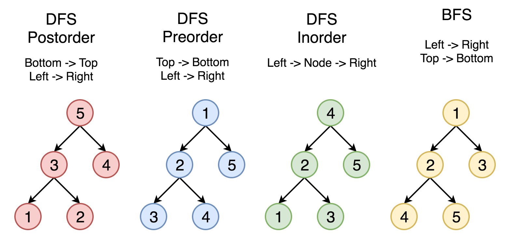

# :snake: Shortest-LeetCode-Python-Solutions
  Leet Code 刷题笔记 - - 不求最快最省，但求最短最优雅 :herb:，Shorter is better here.

# 前言
- 代码精炼是 Python 的核心，同时能够反应对于语言的熟练程度，本项目目的在于汇总 leet code 最短最优雅的解法，拒绝长篇大论，缩短学习周期，掌握各种技巧，助您在面试中写出令人眼前一亮的解答，给考官留个好印象。
- 为什么我们追求最短?1.短代码更pythonic，而且通常能够避免一些冗余过程。2.除了刷题掌握算法思路之外，我们更追求深入理解和掌握python,学会套用技巧，举一反三。3.真正面试的时候不一定要这么短，可以适当展开几行(O_o 除非你就是想秀其他人一脸 😅)，保证思路更清晰，相信就算展开几行也会比其他题解短很多吧。4.刷题很累，找点乐子，送给自己一些成就感吧。5.所有已收录代码都是优中选优，题库解析部分除了短代码外，也有常规解法作为补充。6.若基础知识不够扎实，可以先看[**专题探索**](#专题探索)部分，然后再转[**题库解析**](#题库解析)学习 Python 中隐藏的先进技巧。
- 项目持续更新中，优先使用 python3，不支持的题目使用 python2 代替，如果您有更短更优雅的解法希望分享的话欢迎联系更新~  [直接发issue 或 fork，记得留下署名和联系方式 :panda_face:] 鉴于追求的主题，此项目收录 1.在代码量(不是行数)上明显优于现有解的最短代码 2.思路更高效的一般解法（作为补充放在首选解之后） [题目自带的代码不计入代码量]
- 如果您对当前解析有任何疑问，咱们 issue 见~
- 由于CSDN博客更新需要人工审核比较慢，所以迁移到github上，优先更新github内容。
- 为了快速找到题目可以按 [**Ctrl键 + F键**] 输入题目序号或名字定位。
- 欢迎加入**QQ交流群**：902025048 [∷二维码](QR.png) 群内提供更多相关资料~
# :trophy: 里程碑
- [:penguin: 腾讯精选练习](https://leetcode-cn.com/problemset/all/?listId=ex0k24j)（50题: 25简单 21中等 4困难） 代码行数 总计：140行 平均：2.8行 [:bookmark_tabs: 题目详情](tencent50.png) :calendar: 2019/05/05
- 🧬 数据结构
	- [🐤 队列 & 栈](#-%E9%98%9F%E5%88%97--%E6%A0%88)（5 章节 32 栏目） 高可读，不含VIP解锁题 [:bookmark_tabs: 题目详情](https://leetcode-cn.com/explore/learn/card/queue-stack/) :calendar: 2019/05/31
	- [🐑 数组和字符串](#-%E6%95%B0%E7%BB%84%E5%92%8C%E5%AD%97%E7%AC%A6%E4%B8%B2)（5 章节 29 栏目） 高可读，不含VIP解锁题 [:bookmark_tabs: 题目详情](https://leetcode-cn.com/explore/learn/card/queue-stack/) :calendar: 2019/06/15
	- [🦌 链表](#-%E9%93%BE%E8%A1%A8)（5 章节 26 栏目） 高可读，不含VIP解锁题 [:bookmark_tabs: 题目详情](https://leetcode-cn.com/explore/learn/card/linked-list/197/conclusion/) :calendar: 2019/06/25
	- [🦎 哈希表](#-%E5%93%88%E5%B8%8C%E8%A1%A8)（5 章节 35 栏目） 高可读，不含VIP解锁题 [:bookmark_tabs: 题目详情](https://leetcode-cn.com/explore/learn/card/linked-list/197/conclusion/) :calendar: 2019/07/07
	- [🐄 二分查找](#-%E4%BA%8C%E5%88%86%E6%9F%A5%E6%89%BE)（8 章节 30 栏目） 高可读，不含VIP解锁题 [:bookmark_tabs: 题目详情](https://leetcode-cn.com/explore/learn/card/binary-search/) :calendar: 2019/07/30
	- [🦉 二叉树](#-%E4%BA%8C%E5%8F%89%E6%A0%91)（3 章节 16 栏目） 高可读，不含VIP解锁题 [:bookmark_tabs: 题目详情](https://leetcode-cn.com/explore/learn/card/data-structure-binary-tree/) :calendar: 
## 推荐
- 与本项目有关联的，🛫 是一个[ C++最清晰题解汇总 ](https://github.com/cy69855522/Clearest-LeetCode-Cpp-Solutions)👻。Python篇注重熟悉语言特性，充分利用高级语言提供的已内置的功能避免冗余编码，最低成本地解决问题。C++篇注重通用思想，分专题逐个击破，深入探究算法流程。俩者同时服用效果更佳，只想学一门也不必担心，俩个项目相辅相成，Python篇会在题解之后添加常规解法作为补充，并根据官方推荐的路线总结一套专题探索，C++篇会利用python题解的思想优化代码，保证代码简洁，可读性高。
- 🌟 推荐刷题路线：[**专题探索**](#专题探索) → [腾讯精选50题](https://leetcode-cn.com/problemset/all/?listId=ex0k24j) → [题库解析](#题库解析)
# 题库解析
此专栏追求代码的**精简**和**技巧性**，默认已看过题目，🤡 没看过的话点标题可以跳转链接，咱们一起体验炫酷的 Python
## [1. Two Sum 4行](https://leetcode.com/problems/two-sum/)
```python
class Solution:
    def twoSum(self, nums: List[int], target: int) -> List[int]:
	d = {}
	for i, n in enumerate(nums): 
	    if n in d: return [d[n], i]
	    d[target-n] = i
```
- O(N)时间效率的快速解法，用字典记录 ｛需要的值:当前索引｝
## [2. Add Two Numbers 5行](https://leetcode.com/problems/add-two-numbers/)
```python
# Definition for singly-linked list.
# class ListNode:
#     def __init__(self, x):
#         self.val = x
#         self.next = None

class Solution:
    def addTwoNumbers(self, l1: ListNode, l2: ListNode, carry=0) -> ListNode:
        if not (l1 or l2): return ListNode(1) if carry else None
        l1, l2 = l1 or ListNode(0), l2 or ListNode(0)
        val = l1.val + l2.val + carry
        l1.val, l1.next = val % 10, self.addTwoNumbers(l1.next, l2.next, val > 9)
        return l1
```
- int(True) 等于 1
- None or 7 等于 7
- 用 carry 记录是否应该进位
## [3. Longest Substring Without Repeating Characters 3行](https://leetcode.com/problems/longest-substring-without-repeating-characters/)
```python
class Solution:
    def lengthOfLongestSubstring(self, s: str) -> int:
        i, r, d = 0, 0, {}
        for j, c in enumerate(s): i, r, d[c] = max(i, d.get(c, -1) + 1), max(r, j - i), j
        return max(r, len(s) - i)
```
- 双指针滑动窗口
- i 代表起始位置，r 记录最优解，d 是一个字典，记录所有字符最后出现的位置
- 每次迭代过程中，遇到遇见过的字符时，i 就会变为那个字符上一次出现位置 + 1，r 记录上一次应该达到的全局最大值，所以最后需要再比较一次
## [4. Median of Two Sorted Arrays 5行](https://leetcode.com/problems/median-of-two-sorted-arrays/)
```python
class Solution:
    def findMedianSortedArrays(self, nums1: List[int], nums2: List[int]) -> float:
        a, b, m = *sorted((nums1, nums2), key=len), (len(nums1) + len(nums2) - 1) // 2
        self.__class__.__getitem__ = lambda self, i: m-i-1 < 0 or a[i] >= b[m-i-1]
        i = bisect.bisect_left(self, True, 0, len(a))
        r = sorted(a[i:i+2] + b[m-i:m-i+2])
        return (r[0] + r[1 - (len(a) + len(b)) % 2]) / 2
```
- 本题思路与官方题解类似，时间复杂度O(log(min(m, n)))，没看过的话建议先大体了解一下
- python 中 bisect 模块针对的是 list, 如果直接构造 list，时间复杂度为 O(min(m, n))，因此我们修改当前类的魔法方法伪造 list
- 在一个有序递增数列中，中位数左边的那部分的最大值一定小于或等于右边部分的最小值
- 如果总数组长度为奇数，m 代表中位数的索引，否则 m 代表用于计算中位数的那两个数字的左边一个。比如输入为[1,2]，[3]，那么m应该为[1,2,3]中位数2的索引1，如果输入为[1,3]，[2,4]，那么m应该为[1,2,3,4]中2的索引1
- 使用二分搜索找到 m 对应的值在a或b中对应的索引，也就是说，我们要找的中位数或中位数左部应该是 a[i] 或者 b[m-i]
- bisect.bisect_left 搜索列表中保持列表升序的情况下，True应该插入的位置（从左侧），比如 [F,F,T] 返回 2，[F,F] 返回 2
- 这里保证 a 是 nums1 和 nums2 中较短的那个，是为了防止二分搜索的时候索引越界
- sorted返回一个list，假设返回值是 [nums1, nums2]，那么前面加个 * 号就代表取出列表的所有内容，相当于一个迭代器，结果相当于直接写 nums1, nums2
## [5. Longest Palindromic Substring 5行](https://leetcode.com/problems/longest-palindromic-substring/)
```python
class Solution:
    def longestPalindrome(self, s: str) -> str:
        r = ''
        for i, j in [(i, j) for i in range(len(s)) for j in (0, 1)]:
            while i > -1 and i + j < len(s) and s[i] == s[i + j]: i, j = i - 1, j + 2
            r = max(r, s[i + 1:i + j], key=len)
        return '' if not s else r
```
- 遍历字符串的每个索引 i，判断能否以 s[i] 或 s[i:i+j+1] 为中心向往拓展回文字符串
## [7. Reverse Integer 2行](https://leetcode.com/problems/reverse-integer/)

```python
class Solution:
    def reverse(self, x):
        r = x // max(1, abs(x)) * int(str(abs(x))[::-1])
        return r if r.bit_length() < 32 or r == -2**31 else 0
```
- x // max(1, abs(x))意味着 0：x为0， 1：x为正， -1：x为负，相当于被废弃的函数cmp
- [::-1]代表序列反转
- 2^31 和 -2^31 的比特数为32，其中正负号占用了一位
- 32位整数范围 [−2^31,  2^31 − 1] 中正数范围小一个是因为0的存在
## [8. String to Integer (atoi) 1行](https://leetcode.com/problems/string-to-integer-atoi/)
```python
class Solution:
    def myAtoi(self, s: str) -> int:
        return max(min(int(*re.findall('^[\+\-]?\d+', s.lstrip())), 2**31 - 1), -2**31)
```
- 使用正则表达式 `^：匹配字符串开头，[\+\-]：代表一个+字符或-字符，?：前面一个字符可有可无，\d：一个数字，+：前面一个字符的一个或多个，\D：一个非数字字符，*：前面一个字符的0个或多个`
- `max(min(数字, 2**31 - 1), -2**31)` 用来防止结果越界
## [9. Palindrome Number 1行](https://leetcode.com/problems/palindrome-number/)

```python
class Solution:
    def isPalindrome(self, x: int) -> bool:
        return str(x) == str(x)[::-1]
```
不使用字符串的进阶解法：

```python
class Solution:
    def isPalindrome(self, x: int) -> bool:
        r = list(map(lambda i: int(10**-i * x % 10), range(int(math.log10(x)), -1, -1))) if x > 0 else [0, x]
        return r == r[::-1]
```
- 思路是一样的，这里把整数转成了列表而不是字符串
- 比如一个整数12321，我想取出百位数可以这么做：12321 * 10^{int(log_{10}12321)} % 10 = 123 % 10 = 3
## [11. Container With Most Water 3行](https://leetcode.com/problems/container-with-most-water/)
```python
class Solution:
    def maxArea(self, height: List[int]) -> int:
        res, l, r = 0, 0, len(height) - 1
        while l < r: res, l, r = (max(res,  height[l] * (r - l)), l + 1, r) if height[l] < height[r] else (max(res,  height[r] * (r - l)), l, r - 1)
        return res
```
- 双指针 O(N) 解法
- res：结果，l：容器左壁索引，r：容器右壁索引
- 如果 height[l] < height[r] 那么 l += 1 否则 r -= 1，说明：如果 height[0] < height[3] 那么(0, 1), (0, 2)对应的容器体积一定小于(0, 3)的，因为此时计算体积的时候高为 height(0)，容器的宽减少而高不增加，面积必然缩小
## [13. Roman to Integer 2行](https://leetcode.com/problems/roman-to-integer/)

```python
class Solution:
    def romanToInt(self, s: str) -> int:
        d = {'I':1, 'IV':3, 'V':5, 'IX':8, 'X':10, 'XL':30, 'L':50, 'XC':80, 'C':100, 'CD':300, 'D':500, 'CM':800, 'M':1000}
        return sum(d.get(s[max(i-1, 0):i+1], d[n]) for i, n in enumerate(s))
```
- 构建一个字典记录所有罗马数字子串，注意长度为2的子串记录的值是（实际值-子串内左边罗马数字代表的数值）
- 这样一来，遍历整个s的时候判断当前位置和前一个位置的两个字符组成的字符串是否在字典内，如果在就记录值，不在就说明当前位置不存在小数字在前面的情况，直接记录当前位置字符对应值
- 举个例子，遍历经过IV的时候先记录I的对应值1再往前移动一步记录IV的值3，加起来正好是IV的真实值4。max函数在这里是为了防止遍历第一个字符的时候出现[-1:0]的情况
## [14. Longest Common Prefix 2行](https://leetcode.com/problems/longest-common-prefix/)

```python
class Solution:
    def longestCommonPrefix(self, strs: List[str]) -> str:
        r = [len(set(c)) == 1 for c in zip(*strs)] + [0]
        return strs[0][:r.index(0)] if strs else ''
```
- 利用好zip和set
- os 模块有提供一样的函数
	```python
	class Solution:
	    def longestCommonPrefix(self, strs: List[str]) -> str:
		return os.path.commonprefix(strs)
	```
## [15. 3Sum 5行](https://leetcode.com/problems/3sum/)
```python
class Solution:
    def threeSum(self, nums: List[int]) -> List[List[int]]:
        nums, r = sorted(nums), set()
        for i in [i for i in range(len(nums)-2) if i < 1 or nums[i] > nums[i-1]]:
            d = {-nums[i]-n: j for j, n in enumerate(nums[i + 1:])}
            r.update([(nums[i], n, -nums[i]-n) for j, n in enumerate(nums[i+1:]) if n in d and d[n] > j])
        return list(map(list, r))
```
- 时间复杂度：O(N^2)
- 这里 sort 一是为了避免重复，这一点可以体现在我们输出的结果都是升序的，如果不这么做 set 无法排除一些相同结果，而是为了节省计算，防止超时
- for 循环内部的代码思想同` 第一题 Two Sum`，用字典记录｛需要的值:当前索引｝，如果字典中存在相同的数字，那么将会记录比较大的那个索引，因此可以用`d[n] > i`来避免一个元素重复选择
- `(nums[i], n, -nums[i]-n)`保证了列表升序
## [16. 3Sum Closest 7行](https://leetcode.com/problems/3sum-closest/)
```python
class Solution:
    def threeSumClosest(self, nums: List[int], target: int) -> int:
        nums, r, end = sorted(nums), float('inf'), len(nums) - 1
        for c in range(len(nums) - 2):
            i, j = max(c + 1, bisect.bisect_left(nums, target - nums[end] - nums[c], c + 1, end) - 1), end
            while r != target and i < j:
                s = nums[c] + nums[i] + nums[j]
                r, i, j = min(r, s, key=lambda x: abs(x - target)), i + (s < target), j - (s > target)
        return r
```
- float('inf') = 正无穷
- 排序，遍历，双指针，O(N^2) 时间复杂度，二分法初始化
- 排序是为了使用双指针，首先遍历得到索引 c，然后计算 c，左指针 i，右指针 j 对应数字之和，如果大于 target，j 向内移动，否则 i 向内移动
- i 的初始值不是 c + 1，是为了减少计算量，用二分法得到一个合理的初始值
## [17. Letter Combinations of a Phone Number 3行](https://leetcode.com/problems/letter-combinations-of-a-phone-number/)
```python
class Solution:
    def letterCombinations(self, digits: str) -> List[str]:
        from itertools import product
        l = '- - abc def ghi jkl mno pqrs tuv wxyz'.split()
        return [''.join(c) for c in product(*[l[int(i)] for i in digits])] if digits else []
```
- 本题相当于求解笛卡尔积
## [18. 4Sum 5行](https://leetcode.com/problems/4sum/)
```python
class Solution:
    def fourSum(self, nums: List[int], target: int) -> List[List[int]]:
        from itertools import combinations as com
        dic, l = collections.defaultdict(list), [*com(range(len(nums)), 2)]
        for a, b in l: dic[target - nums[a] - nums[b]].append((a, b))
        r = [(*ab, c, d) for c, d in l for ab in dic[nums[c] + nums[d]]]
        return [*set(tuple(sorted(nums[i] for i in t)) for t in r if len(set(t)) == 4)]
```
- 思想类似于 2SUM，先得到任意两个数字的和记入字典，然后再获得其余任意俩个数字，看看是否匹配。2个 2SUM 相当于 4SUM。时间复杂度为 O(N^2)
- 1.用 combination 获得 nums 中任意两个不同索引的组合
- 2.用字典记录任意两个数字的和，dic =｛除了这两个数字之外还差多少：这俩个数字在 nums 中的索引｝
- 3.用 r 记录所有满足条件的索引序列，注意此时可能含有重复的索引
- 4.利用 len + set 保证 a，b，c，d 各不相等，用 set 删除重复的结果
## [19. Remove Nth Node From End of List 5行](https://leetcode.com/problems/remove-nth-node-from-end-of-list/)
```python
# Definition for singly-linked list.
# class ListNode:
#     def __init__(self, x):
#         self.val = x
#         self.next = None

class Solution:
    def removeNthFromEnd(self, head: ListNode, n: int) -> ListNode:
        l = []
        while head: l, head = l + [head], head.next
        if n != len(l): l[-n-1].next = l[-n].next
        del l[-n]
        return l and l[0]
```
- 列表记录整个链表，换成队列记录最后几个可以把空间复杂度压到 O(1)
## [20. Valid Parentheses 2行](https://leetcode.com/problems/valid-parentheses/)

```python
class Solution:
    def isValid(self, s: str) -> bool:
        while any(('()' in s, '[]' in s, '{}' in s)): s = s.replace('()', '').replace('[]', '').replace('{}', '')
        return not s
```
- 不断删除有效括号直到不能删除，思路简单效率低。另外，stack的方法也很简单，而且快多了。

	```python
	class Solution:
	    def isValid(self, s: str) -> bool:
	        stack, d = [], {'{': '}', '[': ']', '(': ')'}
	        for p in s:
	            if p in '{[(':
	                stack += [p];
	            elif not (stack and d[stack.pop()] == p):
	                return False
	        return not stack
	```

## [21. Merge Two Sorted Lists 4行](https://leetcode.com/problems/merge-two-sorted-lists/)

```python
# Definition for singly-linked list.
# class ListNode:
#     def __init__(self, x):
#         self.val = x
#         self.next = None

class Solution:
    def mergeTwoLists(self, l1: ListNode, l2: ListNode) -> ListNode:
        if l1 and l2:
            if l1.val > l2.val: l1, l2 = l2, l1
            l1.next = self.mergeTwoLists(l1.next, l2)
        return l1 or l2
```
- 7 or 9 等于 7
- None and 7 等于 None
- sorted用在这里为了保证 l1 的值小于等于 l2 的值
## [23. Merge k Sorted Lists 4行](https://leetcode.com/problems/merge-k-sorted-lists/)
```python
# Definition for singly-linked list.
# class ListNode:
#     def __init__(self, x):
#         self.val = x
#         self.next = None

class Solution:
    def mergeKLists(self, lists: List[ListNode]) -> ListNode:
        r, n, p = [], lists and lists.pop(), None
        while lists or n: r[len(r):], n = ([n], n.next or lists and lists.pop()) if n else ([], lists.pop())
        for n in sorted(r, key=lambda x: x.val, reverse=True): n.next, p = p, n
        return n if r else []
```
- 本题思路：
	1. 把题目给的所有链表中的所有节点放进一个列表 r。
	2. 对这个列表 r 中的所有节点进行从大到小的排序。O(NlogN)
	3. 把每个节点的指针指向前一个节点。（第一个节点，也就是最大的那个，指向None。）
	4. 返回最后一个节点，也就是整个新链表的开头。

- 如何把所有节点放进 r(result link)？

	我们首先初始化 r 为空列表，初始化 n(node) 为题目所给的第一个链表的开头节点，并删除lists中的这个节点，接着进入while循环，如果 n 不为空，那么 r += [n]，这里使用了切片的技巧（r[len(r):]=[n]相当于r=r+[n]），n=n.next，如果n是第一个链表的最后一个节点的话n.next就是None，下一次while的时候如果lists不为空就说明还有别的链表，此时n为None，我们让 r 不变，n=lists.pop()，也就是从lists中再取下一个节点赋值给n，重复以上步骤直到 lists 为空，我们就把所有节点放进 r 了。
	
- 怎么对 r 排序？

	用了sorted函数，其中key定义了排序时用来比较的是每个元素的val属性，同时设置reverse为True代表降序排序。
	
- 如何修改每个节点的指针？

	我们初始化 p(previous node) 为None。遍历降序排好的列表 r，r中的第一个元素就是值最大的元素，也就是我们应该返回的链表的结尾，我们设置它指向None，然后让p=这个节点，继续for循环。之后每经过一个节点 n 就把这个节点的next属性设置为上一个节点 p，遍历完成之后的 n，也就是我们遍历经过的最后一个元素，拥有最小的值，自然就是整个新链表的起始节点，我们将其作为输出值，函数返回。
	
## [26. Remove Duplicates from Sorted Array 3行](https://leetcode.com/problems/remove-duplicates-from-sorted-array/)

```python
class Solution:
    def removeDuplicates(self, nums: List[int]) -> int:
        for i in range(len(nums)-1, 0, -1):
            if nums[i] == nums[i-1]: nums.pop(i)
        return len(nums)
```
- 时间效率O(N^2), pop操作的平均时间复杂度为O(N), 空间效率O(1)，逆遍历可以防止删除某个元素后影响下一步索引的定位
- 每次删除数组元素会引发大量的数据迁移操作，使用以下算法解题效率更高
	```python
	class Solution:
	    def removeDuplicates(self, nums: List[int]) -> int:
		i = 0
		for j in range(1, len(nums)):
		    if nums[j] != nums[i]:
			nums[i + 1] = nums[j]
			i += 1
		return i + 1 if nums else 0
	```
	- 此解法思路同官方题解
	- 数组完成排序后，我们可以放置两个指针 i 和 j，其中 i 是慢指针，而 j 是快指针。只要 nums[i] = nums[j]，我们就增加 j 以跳过重复项。当我们遇到 nums[j] != nums[i]时，跳过重复项的运行已经结束，因此我们必须把它（nums[j]）的值复制到 nums[i + 1]。然后递增 i，接着我们将再次重复相同的过程，直到 j 到达数组的末尾为止
## [28. Implement strStr() 1行](https://leetcode.com/problems/implement-strstr/)

```python
class Solution:
    def strStr(self, haystack: str, needle: str) -> int:
		return haystack.find(needle)
```
- 不用内置函数也可以

	```python
	class Solution:
		def strStr(self, haystack: 'str', needle: 'str') -> 'int':
		    for i in range(0, len(haystack) - len(needle) + 1):
		        if haystack[i:i+len(needle)] == needle:
		            return i
	    	return -1
	```
## [29. Divide Two Integers 5行](https://leetcode.com/problems/divide-two-integers/)
```python
class Solution:
    def divide(self, dividend: int, divisor: int) -> int:
        a, b, r, t = abs(dividend), abs(divisor), 0, 1
        while a >= b or t > 1:
            if a >= b: r += t; a -= b; t += t; b += b
            else: t >>= 1; b >>= 1
        return min((-r, r)[dividend ^ divisor >= 0], (1 << 31) - 1)
```
- 让被除数不断减去除数，直到不够减。每次减完后除数翻倍，并记录当前为初始除数的几倍（用 t 表示倍数 time），若发现不够减且 t 不为 1 则让除数变为原来的一半， t 也减半
- a 为被除数绝对值，b 为除数绝对值，r 表示 result，t 表示当前除数对于原始除数的倍数
- a << b 相当于 `a * 2**b`，a >> b 相当于 `a // 2**b`
- 异或操作 ^ 可以判断俩数字是否异号
## [33. Search in Rotated Sorted Array 3行](https://leetcode.com/problems/search-in-rotated-sorted-array/)
```python
class Solution:
    def search(self, nums, target):
        self.__class__.__getitem__ = lambda self, m: not(target < nums[0] <= nums[m] or nums[0] <= nums[m] < target or nums[m] < target <= nums[-1])
        i = bisect.bisect_left(self, True, 0, len(nums))
        return i if target in nums[i:i+1] else -1
```
- 作出数列的函数图像，可以看作是一个含断点的局部递增函数，形如:zap:，前面一段总是比较高
- python 中 bisect 模块针对的是 list, 如果直接构造 list，相当于遍历所有元素，时间复杂度为 O(N) 而不是 O(logN)，因此我们修改当前类的魔法方法伪造 list，然后用当前类代替list
- 用二分搜索时，m 代表 middle，low 代表 low，hi 代表 high，当满足任一条件｛① targe < middle 且 middle 在前一段上 且 target < nums[0] ② target > middle 且 middle 在第一段上 ③ target > middle 且 middle 在第二段上 且 target <= nums[-1]｝时，应该向右搜索，因此 getitem 返回 False。
- 另外还有一种简单的思路：二分法找到断点的位置恢复原始数组，然后正常二分法即可
	```python
	class Solution:
	    def search(self, nums, target):
		lo, hi, k = 0, len(nums) - 1, -1
		while lo <= hi:
		    m = (lo + hi) // 2
		    if m == len(nums) - 1 or nums[m] > nums[m+1]:
			k = m + 1
			break
		    elif m == 0 or nums[m] < nums[m-1]:
			k = m
			break
		    if nums[m] > nums[0]:
			lo = m + 1
		    else:
			hi = m - 1
		i = (bisect.bisect_left(nums[k:] + nums[:k], target) + k) % max(len(nums), 1)
		return i if nums and nums[i] == target else -1
	```
## [35. Search Insert Position 1行](https://leetcode.com/problemset/all/?search=35)
```python
class Solution:
    def searchInsert(self, nums: List[int], target: int) -> int:
        return bisect.bisect_left(nums, target, 0, len(nums))
```
## [36. Valid Sudoku 4行](https://leetcode.com/problems/valid-sudoku/)
```python
class Solution:
    def isValidSudoku(self, board: List[List[str]]) -> bool:
        row = [[x for x in y if x != '.'] for y in board]
        col = [[x for x in y if x != '.'] for y in zip(*board)]
        pal = [[board[i+m][j+n] for m in range(3) for n in range(3) if board[i+m][j+n] != '.'] for i in (0, 3, 6) for j in (0, 3, 6)]
        return all(len(set(x)) == len(x) for x in (*row, *col, *pal))
```
- 利用 set 检查每个区块中是否有重复数字
- pal 取区块的遍历方式是利用 i，j 遍历每个宫格左上角位置，然后取 3*3 区块
## [38. Count and Say 1行](https://leetcode.com/problems/count-and-say/)

```python
class Solution:
    def countAndSay(self, n: int) -> str:
        return '1' * (n is 1) or re.sub(r'(.)\1*', lambda m: str(len(m.group())) + m.group(1), self.countAndSay(n - 1))
```
- 正则表达式 re.sub(正则，替换字符串或函数，被替换字符串，是否区分大小写)
- . 可匹配任意一个除了\n的字符
(.) 匹配任意一个除了\n的字符并把这个匹配结果放进第一组
(.)\1 匹配一个任意字符的二次重复并把那个字符放入数组
(.)\1* 匹配一个任意字符的多次重复并把那个字符放入数组
- group(default=0)可以取匹配文本   group(1)取第一个括号内的文本
## [43. Multiply Strings 5行](https://leetcode.com/problems/multiply-strings/)
```python
class Solution:
    def multiply(self, num1: str, num2: str) -> str:
        d = {}
        for i, n1 in enumerate(num1[::-1]):
            for j, n2 in enumerate(num2[::-1]): d[i + j] = d.get(i + j, 0) + int(n1) * int(n2)
        for k in [*d]: d[k + 1], d[k] = d.get(k + 1, 0) + int(d[k] * 0.1), d[k] % 10
        return re.sub('^0*', '', ''.join(map(str, d.values()))[::-1]) or '0'
```
- 本题的难点在于计算整数的时候不能超过32bits，因此使用竖式计算
- 我们遍历num1中的每个数字n1，然后带着这个数字遍历num2中的每个数字n2做乘法，所得乘积放进 d 中相应的位置然后逐位计算结果
- i + j 正好对应俩个数字相乘后所在的位置，比如 0 + 0 就应该是个位， 0 + 1 就是十位， 1 + 1 百位。这里所说的位置可以参考[这篇博客中的过程图](https://blog.csdn.net/Give_me_the_who/article/details/80313860)
- 若完全不想使用int()可以参考：
	```python
	class Solution:
	    def multiply(self, num1: str, num2: str) -> str:
		d = {}
		for i, n1 in enumerate(num1[::-1]):
		    for j, n2 in enumerate(num2[::-1]):
			d[i + j] = d.get(i + j, 0) + (ord(n1) - 48) * (ord(n2) - 48)
		for k in [*d]:
		    d[k + 1], d[k] = d.get(k + 1, 0) + math.floor(d[k] * 0.1), d[k] % 10
		return re.sub('^0*', '', ''.join(map(str, d.values()))[::-1]) or '0'
	```
## [46. Permutations 1行](https://leetcode.com/problems/permutations/)
```python
class Solution:
    def permute(self, nums: List[int]) -> List[List[int]]:
        return [[n] + sub for i, n in enumerate(nums) for sub in self.permute(nums[:i] + nums[i+1:])] or [nums]
```
- 每次固定第一个数字递归地排列数组剩余部分
- python 有内置函数可以直接实现

	```python
	class Solution:
	    def permute(self, nums: List[int]) -> List[List[int]]:
		from itertools import permutations
		return list(permutations(nums))
	```
## [49. Group Anagrams 1行](https://leetcode.com/problems/group-anagrams/)
```python
class Solution:
    def groupAnagrams(self, strs):
        return [[*x] for _, x in itertools.groupby(sorted(strs, key=sorted), sorted)]
```
- 使用 groupby 函数依据 sorted 结果分组
## [50. Pow(x, n) 2行](https://leetcode.com/problems/powx-n/)
```python
class Solution:
    def myPow(self, x, n, r=1) -> float:
        x, n = n < 0 and 1 / x or x, abs(n)
        return self.myPow(x * x, n // 2, r * (not n % 2 or x)) if n else r
```
- 尾递归 O(logN) 解法
- x^4 正常计算过程：x * x * x * x，O(N)
- 优化后：(x**2)**2，O(logN)
## [53. Maximum Subarray 2行](https://leetcode.com/problems/maximum-subarray/)
```python
class Solution:
    def maxSubArray(self, nums):
        from functools import reduce
        return reduce(lambda r, x: (max(r[0], r[1]+x), max(r[1]+x,x)), nums, (max(nums), 0))[0]
```
- [reduce 函数详解](https://www.cnblogs.com/XXCXY/p/5180245.html)
- r[0]代表以当前位置为结尾的局部最优解
- r[1]代表全局最优解
- 直接DP的解法更好理解一些

	```python
	class Solution:
	    def maxSubArray(self, nums: List[int]) -> int:
	        for i in range(1, len(nums)):
	            nums[i] = max(nums[i], nums[i] + nums[i-1])
	        return max(nums)
	```
## [54. Spiral Matrix 1行](https://leetcode.com/problems/spiral-matrix/)
```python
class Solution:
    def spiralOrder(self, matrix: List[List[int]]) -> List[int]:
        return matrix and [*matrix.pop(0)] + self.spiralOrder([*zip(*matrix)][::-1])
```
- 为什么是`[*matrix.pop(0)]`而不是`matrix.pop(0)`？因为对于后面的递归，传进来的列表中元素是tuple
## [58. Length of Last Word 1行](https://leetcode.com/problems/length-of-last-word/)
```python
class Solution:
    def lengthOfLastWord(self, s: str) -> int:
        return len(s.strip(' ').split(' ')[-1])
```
## [59. Spiral Matrix II 3行](https://leetcode.com/problems/spiral-matrix-ii/)
```python
class Solution:
    def generateMatrix(self, n: int) -> List[List[int]]:
        r, n = [[n**2]], n**2
        while n > 1: n, r = n - len(r), [[*range(n - len(r), n)]] + [*zip(*r[::-1])]
        return r
```
- 流程图
```
||  =>  |9|  =>  |8|      |6 7|      |4 5|      |1 2 3|
		 |9|  =>  |9 8|  =>  |9 6|  =>  |8 9 4|
				     |8 7|      |7 6 5|
```
## [61. Rotate List 4行](https://leetcode.com/problems/rotate-list/)
```python
# Definition for singly-linked list.
# class ListNode:
#     def __init__(self, x):
#         self.val = x
#         self.next = None

class Solution:
    def rotateRight(self, head: ListNode, k: int) -> ListNode:
        l = []
        while head: l[len(l):], head = [head], head.next
        if l: l[-1].next, l[-1 - k % len(l)].next = l[0], None
        return l[- k % len(l)] if l else None
```
## [62. Unique Paths 1行](https://leetcode.com/problems/unique-paths/)

```python
class Solution:
    def uniquePaths(self, m: int, n: int) -> int:
        return int(math.factorial(m+n-2)/math.factorial(m-1)/math.factorial(n-1))
```

- 题目可以转换为排列组合问题，解是C(min(m,n), m+n)，从m+n个中选出m个下移或n个右移。
- 用DP做也很快，以后自己算 C(a, b) 也可以用算这题的DP法代替
- math.factorial 的速度不亚于DP，可能内部有优化
- 0的阶乘为1
## [66. Plus One 1行](https://leetcode.com/problems/plus-one/)

```python
class Solution:
    def plusOne(self, digits: List[int]) -> List[int]:
        return list(map(int, str(int(''.join(map(str, digits))) + 1)))
```
## [67. Add Binary 1行](https://leetcode.com/problems/add-binary/)
```python
class Solution:
    def addBinary(self, a: str, b: str) -> str:
        return bin(int(a, 2) + int(b, 2))[2:]
```
- 非内置函数解法：
```python
class Solution:
    def addBinary(self, a: str, b: str) -> str:
        r, p = '', 0
        d = len(b) - len(a)
        a = '0' * d + a
        b = '0' * -d + b
        for i, j in zip(a[::-1], b[::-1]):
            s = int(i) + int(j) + p
            r = str(s % 2) + r
            p = s // 2
        return '1' + r if p else r
```
## [69. Sqrt(x) 1行](https://leetcode.com/problems/sqrtx/)
```python
class Solution:
    def mySqrt(self, x: int) -> int:
        return int(x ** 0.5)
```
出题者应该是希望看到下面的答案：
```python
class Solution:
    def mySqrt(self, x: int) -> int:
        r = x
        while r*r > x:
            r = (r + x/r) // 2
        return int(r)
```
- 基本不等式(a+b)/2 >=√ab 推导自 (a-b)^2 >= 0，注意 a>0 且 b>0
- r 代表 result
## [70. Climbing Stairs 2行](https://leetcode.com/problems/climbing-stairs/)

```python
class Solution:
    def climbStairs(self, n: int) -> int:
        from functools import reduce
        return reduce(lambda r, _: (r[1], sum(r)), range(n), (1, 1))[0]
```
- dp递归方程：到达当前楼梯的路径数 = 到达上个楼梯的路径数 + 到达上上个楼梯的路径数
- 这里用一个元组 r 来储存（当前楼梯路径数，下一层楼梯路径数）
- 利用 reduce 来代替for循环。[reduce 函数详解](https://www.cnblogs.com/XXCXY/p/5180245.html)
## [78. Subsets 2行](https://leetcode.com/problems/subsets/)
```python
class Solution:
    def subsets(self, nums: List[int]) -> List[List[int]]:
        from itertools import combinations
        return sum([list(combinations(nums, i)) for i in range(len(nums) + 1)], [])
```
## [88. Merge Sorted Array 1行](https://leetcode.com/problems/merge-sorted-array/)

```python
class Solution:
    def merge(self, nums1: List[int], m: int, nums2: List[int], n: int) -> None:
        """
        Do not return anything, modify nums1 in-place instead.
        """
        while n > 0: nums1[m+n-1], m, n = (nums1[m-1], m-1, n) if m and nums1[m-1] > nums2[n-1] else (nums2[n-1], m, n-1)
```
- 这种题倒着算更容易
- 上面那行代码其实就相当于：
	
	```python
	class Solution:
	    def merge(self, nums1: List[int], m: int, nums2: List[int], n: int) -> None:
	        """
	        Do not return anything, modify nums1 in-place instead.
	        """
	        while n > 0:
	            if m and nums1[m-1] > nums2[n-1]:
	                nums1[m+n-1], m, n = nums1[m-1], m-1, n
	            else:
	                nums1[m+n-1], m, n = nums2[n - 1], m, n-1
	```
## [89. Gray Code 1行](https://leetcode.com/problems/gray-code/)
```python
class Solution:
    def grayCode(self, n: int) -> List[int]:
        return (lambda r: r + [x | 1<<n-1 for x in r[::-1]])(self.grayCode(n-1)) if n else [0]
```
- 前4个结果：
	```
	[0]
	[0 1]
	[00 01 11 10]
	[000 001 011 010 110 111 101 100]
	```
- 递归方程：这一步结果 = 上一步结果 + 上一步结果的镜像并在每个二进制数字前面加一位1
- << 左移符号，即在二进制表示后加一位 0 ，例子：3<<1 等于 6`（011 → 110）`，相当于 3 * 2的1次方
- x | 1<<n-1 就是在十进制数字 x 的二进制前面加一位1之后的十进制结果，比如 x = 1，有 1 | 10 等于 110
- 循环可以避免一些不必要的操作，会比递归快一些：
	```python
	class Solution:
	    def grayCode(self, n: int) -> List[int]:
		r = [0]
		for i in range(n):
		    r.extend([x | 1<<i for x in r[::-1]])
		return r
	```
- 或者直接背格雷码的公式🥶吧：
```python
class Solution:
    def grayCode(self, n: int) -> List[int]:
        return [i ^ i >> 1  for i in range(1 << n)]
```
## [91. Decode Ways 4行](https://leetcode.com/problems/decode-ways/)
```python
class Solution:
    def numDecodings(self, s: str) -> int:
        pp, p = 1, int(s[0] != '0')
        for i in range(1, len(s)):
            pp, p = p, pp * (9 < int(s[i-1:i+1]) <= 26) + p * (int(s[i]) > 0)
        return p
```
- 输入 '12' 的结果为 2，如果我们在 '12' 后面增加一个数字 3，输入变成 '123'，结果是 '12'的结果 + '1'的结果 = 3
- i 从索引 1 开始逐渐遍历 s，当前位置对应结果 = 上上次结果(如果 i 位置字符和 i-1 位置字符的组合满足条件) + 上次结果(如果 s[i] 不为 0)
## [94. Binary Tree Inorder Traversal 2行](https://leetcode.com/problems/binary-tree-inorder-traversal/)
```python
# Definition for a binary tree node.
# class TreeNode:
#     def __init__(self, x):
#         self.val = x
#         self.left = None
#         self.right = None

class Solution:
    def inorderTraversal(self, root: TreeNode) -> List[int]:
        f = self.inorderTraversal
        return f(root.left) + [root.val] + f(root.right) if root else []
```
- 递归
```python
class Solution:
    def inorderTraversal(self, root: TreeNode) -> List[int]:
        r, stack = [], []
        while True:
            while root:
                stack.append(root)
                root = root.left
            if not stack:
                return r
            node = stack.pop()
            r.append(node.val)
            root = node.right
        return r
```
- 迭代
## [101. Symmetric Tree 5行](https://leetcode.com/problems/symmetric-tree/)
```python
# Definition for a binary tree node.
# class TreeNode:
#     def __init__(self, x):
#         self.val = x
#         self.left = None
#         self.right = None

class Solution:
    def isSymmetric(self, root: TreeNode) -> bool:
        if not root or root.left is root.right: return True
        l, r, i, o = root.left, root.right, TreeNode(0), TreeNode(0)
        if (l and l.val) != (r and r.val): return False
        i.left, i.right, o.left, o.right = l.left, r.right, l.right, r.left
        return self.isSymmetric(i) and self.isSymmetric(o)
```
- 一棵树对称意味着：
	- 左节点 == 右节点
	- 左节点的左子树与右节点右子树对称
	- 左节点的右子树与右节点左子树对称
- 前三行处理特殊情况：root为None或root无子节点直接返回True，root只有一个子节点或root两个子节点不相等直接返回False
- 第一个条件在前三行处理过了，对于第二和第三个条件，我们分别构造两个假树i(inner)和o(outer)，i代表内假树，对应条件二，o代表外假树，对应条件三。递归内外假树即可
## [104. Maximum Depth of Binary Tree 1行](https://leetcode.com/problems/maximum-depth-of-binary-tree/)
```python
# Definition for a binary tree node.
# class TreeNode:
#     def __init__(self, x):
#         self.val = x
#         self.left = None
#         self.right = None

class Solution:
    def maxDepth(self, root: TreeNode) -> int:
        return max(map(self.maxDepth,(root.left, root.right))) + 1 if root else 0
```
- 利用map函数递归左右节点获取最大值，map函数会将参数一所指向的函数应用于参数二里的所有对象并返回所有结果构成的迭代器
## [112. Path Sum 3行](https://leetcode.com/problems/path-sum/)
```python
# Definition for a binary tree node.
# class TreeNode:
#     def __init__(self, x):
#         self.val = x
#         self.left = None
#         self.right = None

class Solution:
    def hasPathSum(self, root: TreeNode, sum: int) -> bool:
        if not root: return False
        l, r, f = root.left, root.right, lambda x: self.hasPathSum(x, sum - root.val)
        return l is r and sum == root.val or f(l) or f(r)
```
- 考虑初始状态：当树不存在时直接返回 False
- 考虑支路1：当前节点为叶节点时直接判断总和是否达到要求
- 考虑支路2：当前节点为非叶节点时将总和缩小并继续递归，判断左右节点是否存在满足条件的
- 当递归函数到达叶节点时，sum 已经被削减了多次，此时 `sum - node.val` 即为 `原始的sum - 整条路径的总和`
## [118. Pascal's Triangle 1行](https://leetcode.com/problems/pascals-triangle/)
```python
class Solution:
    def generate(self, numRows: int) -> List[List[int]]:
        return [[math.factorial(i)//math.factorial(i-j)//math.factorial(j) for j in range(i+1)] for i in range(numRows)]
```
- 参考了杨辉三角的数学性质，[维基百科](https://en.wikipedia.org/wiki/Pascal%27s_triangle)
- 正常迭代方法：
	```python
	class Solution:
	    def generate(self, numRows: int) -> List[List[int]]:
		r = [[1]]
		for i in range(1, numRows):
		    r.append([1] + [sum(r[-1][j:j+2]) for j in range(i)])
		return numRows and r or []
	```
## [121. Best Time to Buy and Sell Stock 2行](https://leetcode.com/problems/best-time-to-buy-and-sell-stock/)
```python
class Solution:
    def maxProfit(self, prices: List[int]) -> int:
        from functools import reduce
        return reduce(lambda r, p: (max(r[0], p-r[1]), min(r[1], p)), prices, (0, float('inf')))[0]
```
- r = (结果，之前遍历过的所有元素中的最小值)
- [reduce 函数详解](https://www.cnblogs.com/XXCXY/p/5180245.html)
```python
class Solution:
    def maxProfit(self, prices: List[int]) -> int:
        r, m = 0, float('inf')
        for p in prices:
            r, m = max(r, p - m), min(m, p)
        return r
```
## [122. Best Time to Buy and Sell Stock II 2行](https://leetcode.com/problems/best-time-to-buy-and-sell-stock-ii/)
```python
class Solution:
    def maxProfit(self, prices: List[int]) -> int:
        return sum(b - a for a, b in zip(prices, prices[1:]) if b > a)
```
- 本题可以在同一天买入和卖出，因此只要当天票价比昨天的高就可以卖出
## [124. Binary Tree Maximum Path Sum 4行](https://leetcode.com/problems/binary-tree-maximum-path-sum/)
```python
# Definition for a binary tree node.
# class TreeNode:
#     def __init__(self, x):
#         self.val = x
#         self.left = None
#         self.right = None

class Solution:
    def maxPathSum(self, root: TreeNode, ok=True) -> int:
        if not root: return 0
        l, r = self.maxPathSum(root.left, False), self.maxPathSum(root.right, False)
        self.max = max(getattr(self, 'max', float('-inf')), l + root.val + r)
        return self.max if ok else max(root.val + max(l, r), 0)
```
- 使用 self.max 记录全局最大值，getattr 返回自身 max 属性的值或预定义的负无穷
- 本题思路是：递归每一个节点，返回`max(以当前节点为结尾的最大路径和,0)`。并更新最大值`全局最大路径和=max(全局最大路径和，当前节点值+左子树返回结果+右子树返回结果)`
- 用ok判断是不是第一次递归，是就返回全局最大值，否则照常
## [133. Clone Graph](https://leetcode.com/problems/clone-graph/)
```python
"""
# Definition for a Node.
class Node:
    def __init__(self, val, neighbors):
        self.val = val
        self.neighbors = neighbors
"""
class Solution:
    def cloneGraph(self, node: 'Node') -> 'Node':
        return copy.deepcopy(node)
```
- dfs解法请参考 [133克隆图](#133-克隆图)
## [136. Single Number 2行](https://leetcode.com/problems/single-number/)
```python
class Solution:
    def singleNumber(self, nums: List[int]) -> int:
        from functools import reduce
        return reduce(int.__xor__, nums)
```
- 这里用到了异或（xor），相同的数字异或后为0，0异或任何数都等于那个数，用reduce在列表所有元素之间使用异或^，那么留下的就是那个单独的数字了
## [138. Copy List with Random Pointer 1行](https://leetcode.com/problems/copy-list-with-random-pointer/)
```python
"""
# Definition for a Node.
class Node:
    def __init__(self, val, next, random):
        self.val = val
        self.next = next
        self.random = random
"""
class Solution:
    def copyRandomList(self, head: 'Node') -> 'Node':
        return copy.deepcopy(head)
```
- 内置函数
## [139. Word Break 8行](https://leetcode.com/problems/word-break/)
```python
class Solution:
    def wordBreak(self, s, wordDict):
        
        def f(s, d={}):
            if not s in d:
                for i in range(1, 1 + len(s)):
                    d[s[:i]] = s[:i] in wordDict and (i == len(s) or f(s[i:]))
                    if d[s[:i]]: return True
                return False
            return d[s]
        
        return f(s)
```
- brute force + memory
## [141. Linked List Cycle 2行](https://leetcode.com/problems/linked-list-cycle/)
```python
# Definition for singly-linked list.
# class ListNode(object):
#     def __init__(self, x):
#         self.val = x
#         self.next = None

class Solution(object):
    def hasCycle(self, head):
        """
        :type head: ListNode
        :rtype: bool
        """
        while head and head.val != None: head.val, head = None, head.next
        return head != None
```
- 这题不支持python3，所以用pyhton2解法代替，下题记得调回来 :baby_chick:
- 破坏走过的所有节点，下次再遇到就知道了
- 不过以上方法会丢失原有信息，一般解法为快慢指针
```python
# Definition for singly-linked list.
# class ListNode(object):
#     def __init__(self, x):
#         self.val = x
#         self.next = None

class Solution(object):
    def hasCycle(self, head):
        slow = fast = head
        while fast and fast.next:
            fast = fast.next.next
            slow = slow.next
            if slow == fast:
                return True
        return False
```
## [142. Linked List Cycle II 5行](https://leetcode.com/problems/linked-list-cycle-ii/)
```python
# Definition for singly-linked list.
# class ListNode(object):
#     def __init__(self, x):
#         self.val = x
#         self.next = None

class Solution(object):
    def detectCycle(self, head):
        """
        :type head: ListNode
        :rtype: ListNode
        """
        s = {None}
        while head not in s:
            s.add(head)
            head = head.next
        return head
```
- 把见过的节点丢集合里，下次再遇见就是环的开始
- 还有一个纯数学的快慢指针解法，设环的起始节点为 E，快慢指针从 head 出发，快指针速度为 2，设相交节点为 X，head 到 E 的距离为 H，E 到 X 的距离为 D，环的长度为 L，那么有：快指针走过的距离等于慢指针走过的距离加快指针多走的距离（多走了 n 圈的 L） `2(H + D) = H + D + nL`，因此可以推出 `H = nL - D`，这意味着如果我们让俩个慢指针一个从 head 出发，一个从 X 出发的话，他们一定会在节点 E 相遇
	```
				  _____
				 /     \
		 head___________E       \
				\       /
				 X_____/ 
	```
	```python
	class Solution(object):
	    def detectCycle(self, head):
		slow = fast = head
		while fast and fast.next:
		    fast = fast.next.next
		    slow = slow.next
		    if slow == fast:
			break
		else:
		    return None
		while head is not slow:
		    head = head.next
		    slow = slow.next
		return head
	```
## [146. LRU Cache 7行](https://leetcode.com/problems/lru-cache/)
```python
class LRUCache(object):

    def __init__(self, capacity):
        self.od, self.cap = collections.OrderedDict(), capacity

    def get(self, key):
        if key not in self.od: return -1
        self.od.move_to_end(key)
        return self.od[key]

    def put(self, key, value):
        if key in self.od: del self.od[key]
        elif len(self.od) == self.cap: self.od.popitem(False)
        self.od[key] = value


# Your LRUCache object will be instantiated and called as such:
# obj = LRUCache(capacity)
# param_1 = obj.get(key)
# obj.put(key,value)
```
## [148. Sort List 10行](https://leetcode.com/problems/sort-list/)
```python
# Definition for singly-linked list.
# class ListNode:
#     def __init__(self, x):
#         self.val = x
#         self.next = None

class Solution:
    def sortList(self, head: ListNode) -> ListNode:
        if not (head and head.next): return head
        pre, slow, fast = None, head, head
        while fast and fast.next: pre, slow, fast = slow, slow.next, fast.next.next
        pre.next = None
        return self.mergeTwoLists(*map(self.sortList, (head, slow)))
    
    def mergeTwoLists(self, l1: ListNode, l2: ListNode) -> ListNode:
        if l1 and l2:
            if l1.val > l2.val: l1, l2 = l2, l1
            l1.next = self.mergeTwoLists(l1.next, l2)
        return l1 or l2
```
- 使用快慢指针寻找链表中点，并分解链表
- 递归融合俩个有序链表，详解见 21 题
- 此处忽略了递归开栈导致的非 常数级空间复杂度（想太多了吧:laughing:），如果一定要抬杠，推荐使用quicksort
	```python
	class Solution(object):
	    def sortList(self, head):
		"""
		:type head: ListNode
		:rtype: ListNode
		"""
		def partition(start, end):
		    node = start.next.next
		    pivotPrev = start.next
		    pivotPrev.next = end
		    pivotPost = pivotPrev
		    while node != end:
			temp = node.next
			if node.val > pivotPrev.val:
			    node.next = pivotPost.next
			    pivotPost.next = node
			elif node.val < pivotPrev.val:
			    node.next = start.next
			    start.next = node
			else:
			    node.next = pivotPost.next
			    pivotPost.next = node
			    pivotPost = pivotPost.next
			node = temp
		    return [pivotPrev, pivotPost]

		def quicksort(start, end):
		    if start.next != end:
			prev, post = partition(start, end)
			quicksort(start, prev)
			quicksort(post, end)

		newHead = ListNode(0)
		newHead.next = head
		quicksort(newHead, None)
		return newHead.next
	```
## [150. Evaluate Reverse Polish Notation 5行](https://leetcode.com/problems/evaluate-reverse-polish-notation/)
```python
class Solution:
    def evalRPN(self, tokens: List[str]) -> int:
        t, f = tokens.pop(), self.evalRPN
        if t in '+-*/':
            b, a = f(tokens), f(tokens)
            t = eval('a' + t + 'b')
        return int(t)
```
- 递归地返回左右表达式操作后结果
- eval 函数将字符串看作代码得到输出值
## [155. Min Stack 每个1行](https://leetcode.com/problems/min-stack/)
```python
class MinStack:
    
    def __init__(self):
        self.data = [(None, float('inf'))]

    def push(self, x: 'int') -> 'None':
        self.data.append((x, min(x, self.data[-1][1])))

    def pop(self) -> 'None':
        if len(self.data) > 1: self.data.pop()

    def top(self) -> 'int':
        return self.data[-1][0]

    def getMin(self) -> 'int':
        return self.data[-1][1]


# Your MinStack object will be instantiated and called as such:
# obj = MinStack()
# obj.push(x)
# obj.pop()
# param_3 = obj.top()
# param_4 = obj.getMin()
```
## [160. Intersection of Two Linked Lists 3行](https://leetcode.com/problems/intersection-of-two-linked-lists/)
```python
# Definition for singly-linked list.
# class ListNode(object):
#     def __init__(self, x):
#         self.val = x
#         self.next = None

class Solution(object):
    def getIntersectionNode(self, headA, headB):
        """
        :type head1, head1: ListNode
        :rtype: ListNode
        """
        a, b = (headA, headB) if headA and headB else (None, None)
        while a != b: a, b = not a and headB or a.next, not b and headA or b.next
        return a
```
- 这题不支持 Python3 所以只能用 Python2 做了
- 把第一条链表的尾部接到第二条链表的开头，第二条接到第一条的开头，就能消除俩条链表的长度差，并在某一时刻在第一个交叉点相遇，或在走完俩条链表长度的时候同时为 None
	```python
	# 假设有两条链表1→2→3→4和①→②→③，模拟一下算法流程 ↓

	1 → 2 ↘  ↗ → 4                               1 → 2 ↘  ↗ → 4 → ① → → → 3(②) ❤ 相遇了
	① → → → 3(②) → ③   把4接到①前面，把③接到1前面   ① → → → 3(②) → ③ → 1 → 2 ↗     若非相交链表则同时走到None
	```
## [162. Find Peak Element 2行](https://leetcode.com/problems/find-peak-element/)
```python
class Solution:
    def findPeakElement(self, nums: List[int]) -> int:
        self.__class__.__getitem__ = lambda self, i: i and nums[i - 1] > nums[i]
        return bisect.bisect_left(self, True, 0, len(nums)) - 1
```
- [二分查找套路](#-%E4%BA%8C%E5%88%86%E6%9F%A5%E6%89%BE)
- 如果当前位置的左边是更大的数字，则当前位置置为True，继续向左搜索，最后应该插入的位置 = 我们寻找的位置 + 1，因此最后 - 1
## [165. Compare Version Numbers 4行](https://leetcode.com/problems/compare-version-numbers/)
```python
class Solution:
    def compareVersion(self, version1: str, version2: str) -> int:
        v1, v2 = [*map(int, version1.split('.'))], [*map(int, version2.split('.'))]
        d = len(v2) - len(v1)
        v1, v2 = v1 + [0] * d, v2 + [0] * -d
        return (v1 > v2) - (v1 < v2)
```
- 利用 python 序列比较的性质
## [169. Majority Element 1行](https://leetcode.com/problems/majority-element/)
```python
class Solution:
    def majorityElement(self, nums: List[int]) -> int:
        return sorted(nums)[len(nums) // 2]
```
## [171. Excel Sheet Column Number 1行](https://leetcode.com/problems/excel-sheet-column-number/)
```python
class Solution:
    def titleToNumber(self, s: str) -> int:
        return sum((ord(c) - 64) * 26**i for i, c in enumerate(s[::-1]))
```
## [189. Rotate Array 1行](https://leetcode.com/problems/rotate-array/)
```python
class Solution:
    def rotate(self, nums: List[int], k: int) -> None:
        """
        Do not return anything, modify nums in-place instead.
        """
        for _ in range(k % len(nums)): nums[-1:], nums[:0] = [], nums[-1:]
```
- 时间复杂度 = O(k % len(nums))，空间复杂度 = O(1)
## [191. Number of 1 Bits 1行](https://leetcode.com/problems/number-of-1-bits/)
```python
class Solution(object):
    def hammingWeight(self, n):
        """
        :type n: int
        :rtype: int
        """
        return bin(n).count('1')
```
## [198. House Robber 2行](https://leetcode.com/problems/house-robber/)
```python
class Solution:
    def rob(self, nums: List[int]) -> int:
        from functools import reduce
        return reduce(lambda r, n: (max(r[0], n + r[1]), r[0]), nums, (0, 0))[0]
```
- DP递归方程：一直偷到这家的钱 = max（一直偷到上一家的钱，一直偷到上上家的钱 + 这家的钱）😃有点小绕
- 以上为下面代码的化简版，[reduce 函数详解](https://www.cnblogs.com/XXCXY/p/5180245.html)
```python
class Solution:
    def rob(self, nums: List[int]) -> int:
        last, now = 0, 0
        for i in nums:
            last, now = now, max(last + i, now)
        return now
```
- DP不一定要数组，这里两个变量就够了，空间复杂度为O(1)
## [200. Number of Islands 7行](https://leetcode.com/problems/number-of-islands/)
```python
class Solution(object):
    def numIslands(self, grid):
        def sink(i, j):
            if 0 <= i < len(grid) and 0 <= j < len(grid[i]) and int(grid[i][j]):
                grid[i][j] = '0'
                for i, j in zip((i, i+1, i, i-1), (j+1, j, j-1, j)): sink(i, j)
                return 1
            return 0
        return sum(sink(i, j) for i in range(len(grid)) for j in range(len(grid[i])))
```
- 根据题意，我们可以把每一个陆地点当作树根，用 DFS 搜索四周的陆地并沉没它，那么这一整块的陆地都被沉没了，下次我们再遇到陆地点的时候就说明发现新大陆了
## [202. Happy Number 1行](https://leetcode.com/problems/happy-number/)
```python
class Solution:
    def isHappy(self, n: int) -> bool:
        return self.isHappy(sum(int(i) ** 2 for i in str(n))) if n > 4 else n == 1
```
- 不是快乐数的数称为不快乐数(unhappy number)，所有不快乐数的数位平方和计算，最后都会进入 4 → 16 → 37 → 58 → 89 → 145 → 42 → 20 → 4 的循环中
- 这个规律比较难想到的，正常解法是判断n是否会进入循环：
```python
class Solution:
    def isHappy(self, n: int) -> bool:
        seen = {1}
        while n not in seen:
            seen.add(n)
            n = sum(int(i) ** 2 for i in str(n))
        return n == 1
```
## [203. Remove Linked List Elements 2行]()
```python
# Definition for singly-linked list.
# class ListNode:
#     def __init__(self, x):
#         self.val = x
#         self.next = None

class Solution:
    def removeElements(self, head: ListNode, val: int) -> ListNode:
        if head: head.next = self.removeElements(head.next, val)
        return head.next if head and head.val == val else head
```
- 递归：每次都返回从当前位置算起第一个有效的节点或None
## [205. Isomorphic Strings 1行](https://leetcode.com/problems/isomorphic-strings/)
```python
class Solution:
    def isIsomorphic(self, s: str, t: str) -> bool:
        return [*map(s.index, s)] == [*map(t.index, t)]
```
- 同构代表两个字符串中每个位置上字符在自身第一次出现的索引相同
## [206. Reverse Linked List 2行](https://leetcode.com/problems/reverse-linked-list/)
```python
# Definition for singly-linked list.
# class ListNode:
#     def __init__(self, x):
#         self.val = x
#         self.next = None

class Solution:
    def reverseList(self, head: ListNode, tail=None) -> ListNode:
        if head: head.next, tail, head = tail, head, head.next
        return self.reverseList(head, tail) if head else tail
```
- 递归解法
- 此解法为尾递归，即直接以递归返回值作为结果，一般编译器会做优化，避免多余的函数开栈操作，实现效果相当于迭代
```python
# Definition for singly-linked list.
# class ListNode:
#     def __init__(self, x):
#         self.val = x
#         self.next = None

class Solution:
    def reverseList(self, head: ListNode) -> ListNode:
        p = None
        while head: head.next, p, head = p, head, head.next
        return p
```
- 迭代解法
## [215. Kth Largest Element in an Array 1行](https://leetcode.com/problems/kth-largest-element-in-an-array/)
```python
class Solution:
    def findKthLargest(self, nums: List[int], k: int) -> int:
        return sorted(nums)[-k]
```
- O(NlogN)调库
- 面试官一般不会接受以上答案的，可以参考下面这个O(N)的quick-selection，思路借鉴的quick-sort
	```python
	class Solution:
	    def findKthLargest(self, nums: List[int], k: int) -> int:
		l = [x for x in nums if x > nums[0]]
		m = [x for x in nums if x == nums[0]]
		r = [x for x in nums if x < nums[0]]
		f = self.findKthLargest

		if k <= len(l):
		    return f(l, k)
		elif k <= len(l) + len(m):
		    return nums[0]
		return f(r, k - len(l) - len(m))
	```
## [217. Contains Duplicate 1行](https://leetcode.com/problems/contains-duplicate/)
```python
class Solution:
    def containsDuplicate(self, nums: List[int]) -> bool:
        return len(nums) != len(set(nums))
```
## [219. Contains Duplicate II 4行](https://leetcode.com/problems/contains-duplicate-ii/)
```python
class Solution:
    def containsNearbyDuplicate(self, nums: List[int], k: int) -> bool:
        r, d = k + 1, {}
        for i, n in enumerate(nums):
            r, d[n] = min(r, i - d.get(n, -k - 1)), i
        return r <= k
```
- 本题题目有误，实际意思是找同数字最小间隔，若不超过 k 则满足条件
- 遍历列表，每次都比对最小间隔，并更新哈希表索引，当前位置往左的最小间隔一定是与上一次同数字出现的索引的距离
## [225. Implement Stack using Queues 6行](https://leetcode-cn.com/problems/implement-stack-using-queues/submissions/)
```python
class MyStack:

    def __init__(self):
        self.q = collections.deque()

    def push(self, x):
        self.q.append(x)
        for _ in range(len(self.q) - 1): self.q.append(self.q.popleft())
        
    def pop(self):
        return self.q.popleft()

    def top(self):
        return self.q[0]
    
    def empty(self):
        return not len(self.q)
```
- push 的时候把 x 放入队尾，然后遍历一遍原始队列元素，每次弹出之后加入队尾
## [230. Kth Smallest Element in a BST 3行](https://leetcode.com/problems/kth-smallest-element-in-a-bst/)
```python
# Definition for a binary tree node.
# class TreeNode:
#     def __init__(self, x):
#         self.val = x
#         self.left = None
#         self.right = None

class Solution:
    def kthSmallest(self, root, k):
        from itertools import chain, islice
        def gen(x): yield from chain(gen(x.left), [x.val], gen(x.right)) if x else ()
        return next(islice(gen(root), k - 1, k))
```
- 本题利用迭代器骚了一波:grinning:，不太了解的话看这里 [yield 推荐阅读博客](https://blog.csdn.net/mieleizhi0522/article/details/82142856)
- chain 函数可以组合多个迭代器，islice 函数对迭代器做切片操作
- 此题常规解法 中序遍历 还是需要了解下的
	```python
	# Definition for a binary tree node.
	# class TreeNode(object):
	#     def __init__(self, x):
	#         self.val = x
	#         self.left = None
	#         self.right = None

	class Solution(object):
	    def kthSmallest(self, root, k):
		"""
		:type root: TreeNode
		:type k: int
		:rtype: int
		"""
		res = []
		self.visitNode(root, res)
		return res[k - 1]

	    # 中序遍历
	    def visitNode(self, root, res):
		if root is None:
		    return
		self.visitNode(root.left, res)
		res.append(root.val)
		self.visitNode(root.right, res)
	```
## [231. 2的幂 1行](https://leetcode.com/problems/power-of-two/)
```python
class Solution:
    def isPowerOfTwo(self, n: int) -> bool:
	"""
	:type n: int
	:rtype: bool
	"""
        return n > 0 and n & n - 1 == 0
```
- 2 的幂的二进制形式最高位一定是1，其余为0
- 用常规思路也行
	```python
	class Solution(object):
	    def isPowerOfTwo(self, n):
		return n > 0 and 2**int(math.log2(n)) == n
	```
## [232. Implement Queue using Stacks 13行](https://leetcode.com/problems/implement-queue-using-stacks/)
```python
class MyQueue:

    def __init__(self):
        """
        Initialize your data structure here.
        """
        self.stack = []

    def push(self, x: int) -> None:
        """
        Push element x to the back of queue.
        """
        self.stack.append(x)

    def pop(self) -> int:
        """
        Removes the element from in front of queue and returns that element.
        """
        temp = []
        while self.stack: temp.append(self.stack.pop())
        r = temp.pop()
        while temp: self.stack.append(temp.pop())
        return r

    def peek(self) -> int:
        """
        Get the front element.
        """
        temp = []
        while self.stack: temp.append(self.stack.pop())
        r = temp[-1]
        while temp: self.stack.append(temp.pop())
        return r

    def empty(self) -> bool:
        """
        Returns whether the queue is empty.
        """
        return not self.stack


# Your MyQueue object will be instantiated and called as such:
# obj = MyQueue()
# obj.push(x)
# param_2 = obj.pop()
# param_3 = obj.peek()
# param_4 = obj.empty()
```
- 使用俩个栈来模拟队列，当需要取第一个元素的时候创建一个临时的栈temp，把栈里面的东西全部抽出来放进temp，完成操作后放回去
## [234. Palindrome Linked List 3行](https://leetcode.com/problems/palindrome-linked-list/)
```python
# Definition for singly-linked list.
# class ListNode:
#     def __init__(self, x):
#         self.val = x
#         self.next = None

class Solution:
    def isPalindrome(self, head: ListNode) -> bool:
        def gen(n):
            while n: yield n.val; n = n.next
        return [*gen(head)] == [*gen(head)][::-1]
```
## [235. Lowest Common Ancestor of a Binary Search Tree 2行](https://leetcode.com/problems/lowest-common-ancestor-of-a-binary-search-tree/)
```python
# Definition for a binary tree node.
# class TreeNode:
#     def __init__(self, x):
#         self.val = x
#         self.left = None
#         self.right = None

class Solution:
    def lowestCommonAncestor(self, root, p, q):
        while (root.val - p.val) * (root.val - q.val) > 0: root = (root.left, root.right)[p.val > root.val]
        return root
```
- 最近公共祖先的值一定介于p、q值之间(闭区间)
## [236. Lowest Common Ancestor of a Binary Tree 2行](https://leetcode.com/problems/lowest-common-ancestor-of-a-binary-tree/)
```python
# Definition for a binary tree node.
# class TreeNode:
#     def __init__(self, x):
#         self.val = x
#         self.left = None
#         self.right = None

class Solution:
    def lowestCommonAncestor(self, root: 'TreeNode', p: 'TreeNode', q: 'TreeNode') -> 'TreeNode':
        l, r = map(lambda x: x and self.lowestCommonAncestor(x, p, q), (root.left, root.right))
        return (root in (p, q) or l and r) and root or l or r
```
- 递归全部节点，p 的祖先节点全部返回 p，q 的祖先节点全部返回 q，除非它同时是俩个节点的最近祖先，也就是 p，q 分别位于左右子树，那么返回自身
- 这思路用在[235](https://leetcode.com/problems/lowest-common-ancestor-of-a-binary-search-tree/)也行
## [237. Delete Node in a Linked List 1行](https://leetcode.com/problems/delete-node-in-a-linked-list/)
```python
# Definition for singly-linked list.
# class ListNode:
#     def __init__(self, x):
#         self.val = x
#         self.next = None

class Solution:
    def deleteNode(self, node):
        """
        :type node: ListNode
        :rtype: void Do not return anything, modify node in-place instead.
        """
        node.val, node.next = node.next.val, node.next.next
```
- `node = node.next`是不行的，因为这里只是改了函数参数引用的对象，而原来传进来的 node 没有任何改变
- 详细说明下：如果Python的函数得到的参数是可变对象（比如list，set，这样的，内部属性可以改变的），那么我们实际得到的是这个对象的浅拷贝。比如这个函数刚刚开始的时候题目传进来一个参数node，我们设这个节点为A，那么实际上得到的参数node是一个对于A的一个浅拷贝，你可以想象node是一把钥匙，它可以打开真正的节点A的门，如果我们现在让`node = node.next`，那么我们只是换了钥匙，变成了打开 A.next 的门的对应的钥匙，因此链表没有被修改， A没有被修改，只是我们手里的钥匙变了。而如果我们直接写`node.val, node.next = node.next.val, node.next.next`，就相当于我们先用钥匙找到 A 的门，然后修改了 A 的属性，链表发生变化
- 此题考查python函数的传参形式为“传对象引用”，相当于浅拷贝（对于可变对象来说）
## [238. Product of Array Except Self 5行](https://leetcode.com/problems/product-of-array-except-self/)
```python
class Solution:
    def productExceptSelf(self, nums: List[int]) -> List[int]:
        res, l, r = [1] * len(nums), 1, 1
        for i, j in zip(range(len(nums)), reversed(range(len(nums)))):
            res[i], l = res[i] * l, l * nums[i]
            res[j], r = res[j] * r, r * nums[j]
        return res
```
- O(N)双指针双向遍历
## [240. Search a 2D Matrix II 1行](https://leetcode.com/problems/search-a-2d-matrix-ii/)
```python
class Solution:
    def searchMatrix(self, matrix, target):
        """
        :type matrix: List[List[int]]
        :type target: int
        :rtype: bool
        """
        return any(target in row for row in matrix)
```
- 以下为 O(m+n) 解法：
	```python
	class Solution:
	    def searchMatrix(self, matrix, target):
		"""
		:type matrix: List[List[int]]
		:type target: int
		:rtype: bool
		"""
		j = -1
		for row in matrix:
		    while j > -len(row) and row[j] > target:
			j -= 1
		    if row and row[j] == target:
			return True
		return False
	```
	- 从矩阵右上角开始，若值比 target 大则证明这一列的值都比 target 大，继续搜索前面的列；若比 target 小说明 target 可能在后面的行中，进入下一行
## [258. Add Digits 1行](https://leetcode.com/problems/add-digits/)
```python
class Solution:
    def addDigits(self, num: int) -> int:
        return num % 9 or 9 * bool(num)
```
- O(1) 数学推理：设某个数字的字符串表示为`'abc'`，则这个数字代表`a*100 + b*10 + c`，转换后成为`a + b + c`，可见每次转换相当于把原数字减去`a*99 + b*9 = 9 * (a*11 + b)`，可以推出只要高于个位的位置上有数字，算法就会减去一个小于原数字的9的倍数，这就相当于`数字 % 9`。但`9 % 9 = 0`，而 9 本身就没有十位，因此需要考虑原数字是 0 或 9 的倍数的特殊情况
- 首先计算`num % 9`，若结果为 0 则考虑`num`本身是否为 0，若不为 0 返回 9
```python
class Solution:
    def addDigits(self, num: int) -> int:
        while num > 9:
            num = eval('+'.join(n for n in str(num)))
        return num
```
- 循环判断
## [268. Missing Number 1行](https://leetcode.com/problems/missing-number/)
```python
class Solution:
    def missingNumber(self, nums: List[int]) -> int:
        return int(len(nums) * (len(nums) + 1) / 2 - sum(nums))
```
- 等差数列求和公式
## [278. First Bad Version 2行](https://leetcode.com/problems/first-bad-version/)
```python
# The isBadVersion API is already defined for you.
# @param version, an integer
# @return a bool
# def isBadVersion(version):

class Solution:
    def firstBadVersion(self, n):
        """
        :type n: int
        :rtype: int
        """
        self.__class__.__getitem__ = lambda self, x: isBadVersion(x)
        return bisect.bisect_left(self, True, 1, n)
```
- 改造当前类的魔法方法getitem以使用内置函数
- 复现二分搜索解法如下：
```python
# The isBadVersion API is already defined for you.
# @param version, an integer
# @return a bool
# def isBadVersion(version):

class Solution:
    def firstBadVersion(self, n):
        """
        :type n: int
        :rtype: int
        """
        l, h = 1, n
        while l <= h:
            m = (l + h) // 2
            if isBadVersion(m) > m * isBadVersion(m - 1):
                return m
            elif isBadVersion(m):
                h = m - 1
            else:
                l = m + 1
```
- 本题二分搜索中判断返回的条件为 当前版本为True且（当前索引为0 或 左边的版本为False）
- `m *` 的作用是避免 `m - 1` 为负数，如果 m 为 0，则代表左边没有版本，只需判断当前版本是否为 True
- True > False 或 0
## [279. Perfect Squares 4行](https://leetcode.com/problems/perfect-squares/)
```python
class Solution:
    def numSquares(self, n: int) -> int:
        dp = [0]
        for i in range(1, n+1):
            dp.append(min(dp[-j*j] for j in range(1, 1 + int(i**0.5))) + 1)
        return dp[-1]
```
- dp方程：总和为 n 的最小完全平方数个数 = min(总和为 (n - 某个完全平方数) 的最小完全平方数个数) + 1
- 中文版力扣这题用dp会超时，可以[使用bfs](#279-完全平方数)，或者**拉格朗日四平方数和定理** 😎：任何一个正整数都可以表示成不超过四个整数的平方之和。 推论：满足四数平方和定理的数n（四个整数的情况），必定满足 n=4^a(8b+7)
```python
class Solution:
    def numSquares(self, n: int) -> int:
        while n % 4 == 0:
            n /= 4
        if n % 8 == 7:
            return 4
        
        a = 0
        while a**2 <= n:
            b = int((n - a**2)**0.5) 
            if a**2 + b**2 == n:
                return bool(a) + bool(b) 
            a += 1
        
        return 3
```
## [283. Move Zeroes 1行](https://leetcode.com/problems/move-zeroes/)
```python
class Solution:
    def moveZeroes(self, nums: List[int]) -> None:
        """
        Do not return anything, modify nums in-place instead.
        """
        nums.sort(key=bool, reverse=True)
```
- sort 时间复杂度为O(NlogN), 直接遍历可以达到 O(N)
```python
class Solution:
    def moveZeroes(self, nums: List[int]) -> None:
        """
        Do not return anything, modify nums in-place instead.
        """
        i = 0
        for i, n in enumerate(filter(lambda x: x, nums)):
            nums[i] = n
        for i in range(i + 1, len(nums)):
            nums[i] = 0
```
- 直接使用 filter 迭代器可以避免交换操作，思路更简单
## [287. Find the Duplicate Number 2行](https://leetcode.com/problems/find-the-duplicate-number/)
```python
class Solution:
    def findDuplicate(self, nums: List[int]) -> int:
        self.__class__.__getitem__ = lambda sef, m: sum(n <= m for n in nums) > m
        return bisect.bisect_left(self, True, 1, len(nums) - 1)
```
- 本题可用二分查找，整个算法时间复杂度为 O(NlogN)，由题意可知搜索范围在 1 到 n 之间，那么如何缩小范围？只需判断数组中不超过中间数 m 的元素数量是否大于 m 即可，若大于，则表示范围 1 到 m 内肯定包含重复的数字
- 搜索范围为 [1, n]，向左（包括target）搜索的条件为：不大于 n 的数字在 nums 存在超过 m 个，即搜索范围可以被缩小为 [1, m]
## [292. Nim Game 1行](https://leetcode.com/problems/nim-game/)
```python
class Solution:
    def canWinNim(self, n: int) -> bool:
        return bool(n % 4)
```
- 只要轮到你的时候剩余石头数量不是 4 的倍数都是完胜，因为你有办法使得每次轮到对方的时候剩余石头数量都为 4 的倍数
## [326. Power of Three 1行](https://leetcode.com/problems/power-of-three/)
```python
class Solution:
    def isPowerOfThree(self, n: int) -> bool:
        return n > 0 and 3 ** round(math.log(n, 3)) == n
```
- math.log 函数得到的数据可能不够精确，可以使用 round 取整
## [328. Odd Even Linked List 6行](https://leetcode.com/problems/odd-even-linked-list/)
```python
# Definition for singly-linked list.
# class ListNode:
#     def __init__(self, x):
#         self.val = x
#         self.next = None

class Solution:
    def oddEvenList(self, head: ListNode) -> ListNode:
        if not head or not head.next: return head
        r, odd, p, head = head, head, head.next, head.next.next
        while head:
            odd.next, head.next, p.next = head, odd.next, head.next
            p, odd, head = p.next, head, p.next and p.next.next
        return r
```
- odd 记录上一个奇数位节点，p 记录前一个节点
- 从第3个位置开始循环，每次都把当前节点接到 odd 后面，然后跳到下一个奇数位节点继续循环
## [344. Reverse String 1行](https://leetcode.com/problems/reverse-string/)
```python
class Solution:
    def reverseString(self, s: List[str]) -> None:
        """
        Do not return anything, modify s in-place instead.
        """
        s.reverse()
```
## [345. Reverse Vowels of a String 2行](https://leetcode.com/problems/reverse-vowels-of-a-string/)
```python
class Solution:
    def reverseVowels(self, s: str) -> str:
        vowels = re.findall('(?i)[aeiou]', s)
        return re.sub('(?i)[aeiou]', lambda m: vowels.pop(), s)
```
- 遍历俩次，第一次找出元音字母放进 stack，第二次每遇到一个就把之前的栈顶替换进来
## [347. Top K Frequent Elements 1行](https://leetcode.com/problems/top-k-frequent-elements/)
```python
class Solution:
    def topKFrequent(self, nums: List[int], k: int) -> List[int]:
        return [*next(zip(*collections.Counter(nums).most_common(k)))]
```
- Counter类的目的是用来跟踪值出现的次数。它是一个无序的容器类型，以字典的键值对形式存储，其中元素作为key，其计数作为value
- 关于 Counter，更多详细内容可参考 [这里](https://www.cnblogs.com/nisen/p/6052895.html)
- 非内置解法：
```python
class Solution:
    def topKFrequent(self, nums: List[int], k: int) -> List[int]:
        d = {n: 0 for n in nums}
        for n in nums:
            d[n] += 1
        
        r = []
        for _ in range(k):
            n = max(d, key=d.get)
            r.append(n)
            d[n] = -1
        
        return r
```
## [349. Intersection of Two Arrays 1行](https://leetcode.com/problems/intersection-of-two-arrays/)
```python
class Solution:
    def intersection(self, nums1: List[int], nums2: List[int]) -> List[int]:
        return [*set(nums1) & set(nums2)]
```
- 经过 set 之后，重复的元素被删除
- 与运算对于集合来说就是求交集
## [350. Intersection of Two Arrays II 1行](https://leetcode.com/problems/intersection-of-two-arrays-ii/)
```python
class Solution:
    def intersect(self, nums1: List[int], nums2: List[int]) -> List[int]:
        return [*(collections.Counter(nums1) & collections.Counter(nums2)).elements()]
```
- 对于两个 Counter 对象，与操作意味着取两者都有的key, value取小的那一个
- 参考：[Python Counter 计数工具](https://www.cnblogs.com/nisen/p/6052895.html)
```python
class Solution:
    def intersect(self, nums1: List[int], nums2: List[int]) -> List[int]:
        nums1.sort()
        nums2.sort()
        r = []
        i = j = 0
        while i < len(nums1) and j < len(nums2):
            if nums1[i] == nums2[j]:
                r.append(nums1[i])
                i += 1
                j += 1
            elif nums1[i] < nums2[j]:
                i += 1
            else:
                j += 1
        return r
```
- 进阶解法 ↑
- 使用双指针将两个列表中共同的元素抠下来，因为已经排序，所以遇到不同元素时数值小的那个列表的指针向前移动
## [367. Valid Perfect Square 4行](https://leetcode.com/problems/valid-perfect-square/)
```python
class Solution:
    def isPerfectSquare(self, num: int) -> bool:
        r = num
        while r * r > num:
            r = (r + num / r) // 2
        return r * r == num
```
- 基本不等式(a+b)/2 >=√ab 推导自 (a-b)^2 >= 0 → a^2 + b^2 >= 2ab → (a+b)/2 >=√ab（换元），注意 a>0 且 b>0
- `(r + num / r) / 2` >= √num 而 r > num / r 保证每次迭代 r 在不断减小,而`//`的存在保证最接近的时候能够逃离循环体
## [387. First Unique Character in a String 2行](https://leetcode.com/problems/first-unique-character-in-a-string/)
```python
class Solution:
    def firstUniqChar(self, s: str) -> int:
        d = {c: s.count(c) for c in set(s)}
        return ([i for i, c in enumerate(s) if d[c] == 1] + [-1])[0]
```
- 首先用字典 d 储存｛字符：出现次数｝，注意这里的字符来自 set，为了避免重复操作，防止TLE
- 用 list 记录 s 中出现次数为 1 的字符的索引
- 返回 list 第一个元素，如果原来的 s 中不存在出现次数为 1 的字符，则会返回后面添加的 [-1] 作为第一个元素
## [389. Find the Difference](https://leetcode.com/problems/find-the-difference/)
```python
class Solution:
    def findTheDifference(self, s: str, t: str) -> str:
        return chr(sum(map(ord, t)) - sum(map(ord, s)))
```
- 每一个字符都对应一个 ASCII 数字，那么那个不同的数字的 ASCII 码就等于 t 的所有字符码之和 - s 的
- ord 函数将单个字符转换为 ASCII 码， chr相反
## [394. Decode String 14行](https://leetcode.com/problems/decode-string/)
```python
class Solution:
    def decodeString(self, s: str) -> str:
        stack = [['', 1, '']]
        a = n = ''
        for c in s:
            if c.isalpha():
                a += c
            elif c.isdigit():
                n += c
            elif c == '[':
                stack.append([a, int(n), ''])
                a = n = ''
            else:
                p, t, b = stack.pop()
                stack[-1][-1] += p + t * (b + a)
                a = ''
        return stack.pop()[-1] + a
```
- 用 stack 记录（[]之前的字母，翻倍次数，翻倍内容）
## [412. Fizz Buzz 1行](https://leetcode.com/problems/fizz-buzz/)

```python
class Solution:
    def fizzBuzz(self, n):
        return ['Fizz' * (not i % 3) + 'Buzz' * (not i % 5) or str(i) for i in range(1, n+1)]
```
- 7 or 8 = 7
- 0 or 8 = 8
## [414. Third Maximum Number 3行](https://leetcode.com/problems/third-maximum-number/)
```python
class Solution:
    def thirdMax(self, nums: List[int]) -> int:
        nums = set(nums)
        for _ in range((2, 0)[len(nums) < 3]): nums.remove(max(nums))
        return max(nums)
```
## [430. Flatten a Multilevel Doubly Linked List 5行](https://leetcode.com/problems/flatten-a-multilevel-doubly-linked-list/)
```python
"""
# Definition for a Node.
class Node:
    def __init__(self, val, prev, next, child):
        self.val = val
        self.prev = prev
        self.next = next
        self.child = child
"""
from itertools import chain

class Solution:
    def flatten(self, head: 'Node') -> 'Node':
        def gen(n): yield from chain([n], gen(n.child), gen(n.next)) if n else ()
        iters = gen(head); p = head and next(iters)
        for n in iters: p.next, n.prev, p.child, n.child, p = n, p, None, None, n
        return head
```
- 使用迭代器按顺序输出所有节点，然后连接
## [448. Find All Numbers Disappeared in an Array 1行](https://leetcode.com/problems/find-all-numbers-disappeared-in-an-array/)
```python
class Solution:
    def findDisappearedNumbers(self, nums: List[int]) -> List[int]:
        s = set(nums)
        return [i for i in range(1, len(nums) + 1) if i not in s]
```
- set 的内部实现为 dict，in 操作时间复杂度为 O(1)
- 应题目进阶要求，以下解为 O(N) 时间效率，无额外空间（除了返回数组和中间变量）
	```python
	class Solution:
	    def findDisappearedNumbers(self, nums: List[int]) -> List[int]:
		for n in nums:
		    nums[abs(n) - 1] = -abs(nums[abs(n) - 1])
		return [i + 1 for i, n in enumerate(nums) if n > 0]
	```
	- 此解实际上是利用索引把数组自身当作哈希表处理
	- 将 nums 中所有正数作为索引i，置 nums[i] 为负值。那么，仍为正数的位置即为（未出现过）消失的数字
	    - 原始数组：[4,3,2,7,8,2,3,1]
	    - 重置后为：[-4,-3,-2,-7,`8`,`2`,-3,-1]
	    - 结论：[8,2] 分别对应的index为[5,6]（消失的数字）
## [454. 4Sum II 2行](https://leetcode.com/problems/4sum-ii/)
```python
class Solution:
    def fourSumCount(self, A: List[int], B: List[int], C: List[int], D: List[int]) -> int:
        dic = collections.Counter(a + b for a in A for b in B)
        return sum(dic.get(- c - d, 0) for c in C for d in D)
```
- 思路同第一题 TWO SUM 的 O(N) 字典解法，记录需要的值
## [461. Hamming Distance 1行](https://leetcode.com/problems/hamming-distance/)
```python
class Solution:
    def hammingDistance(self, x: int, y: int) -> int:
        return bin(x ^ y).count('1')
```
## [485. Max Consecutive Ones 1行](https://leetcode.com/problems/max-consecutive-ones/)
```python
class Solution:
    def findMaxConsecutiveOnes(self, nums: List[int]) -> int:
        return len(max(''.join(map(str, nums)).split('0')))
```
- 变成字符串然后用"0"去切分然后比子串长度
## [494. Target Sum 5行](https://leetcode.com/problems/target-sum/)
```python
class Solution:
    def findTargetSumWays(self, nums: List[int], S: int) -> int:
        
        def dfs(cur, i, d = {}):
            if i < len(nums) and (i, cur) not in d: # 搜索周围节点
                d[(i, cur)] = dfs(cur + nums[i], i + 1) + dfs(cur - nums[i], i + 1)
            return d.get((i, cur), int(cur == S))
        
        return dfs(0, 0)
```
- dfs遍历所有可能结果，以当前位置 i 和当前总和 cur 为根节点，以下一位数字的加减为邻域扩散搜索
- 利用 d 构造记忆，以便剪枝（搜索过程中遇到相同位置和相同cur值时返回值应该相同）
- dfs中 d 参数传的是引用，所以只有第一次会采用默认值 {}
## [495. Teemo Attacking](https://leetcode.com/problems/teemo-attacking/)
```python
class Solution:
    def findPoisonedDuration(self, t: List[int], d: int) -> int:
        return len(t) and sum(min(t[i] - t[i-1], d) for i in range(1, len(t))) + d
```
- 总时间 = 所有间隔时间的总和，每一次的间隔时间 = min(下次发射时间 - 这次发射时间，duration)
## [498. Diagonal Traverse 5行](https://leetcode.com/problems/diagonal-traverse/)
```python
class Solution:
    def findDiagonalOrder(self, matrix: List[List[int]]) -> List[int]:
        m, n, r = len(matrix), len(matrix) and len(matrix[0]), []
        for l in range(m + n - 1):
            temp = [matrix[i][l - i] for i in range(max(0, l+1 - n), min(l+1, m))]
            r += temp if l % 2 else temp[::-1]
        return r
```
- 0 and 0 答案是 0，此处避免 matrix 为 [] 时导致报错
- 按照从右上角到左下角的顺序遍历 matrix 的所有对角线并放入列表 temp
- 如果 对角线元素个数 是偶数则应该把 temp 反转
- 把 temp 加入结果 r
## [557. Reverse Words in a String III 1行](https://leetcode.com/problems/reverse-words-in-a-string-iii/)
```python
class Solution:
    def reverseWords(self, s: str) -> str:
        return ' '.join(s.split(' ')[::-1])[::-1]
```
## [561. Array Partition I 1行](https://leetcode.com/problems/array-partition-i/)
```python
class Solution:
    def arrayPairSum(self, nums: List[int]) -> int:
        return sum(sorted(nums)[::2])
```
## [575. Distribute Candies 1行](https://leetcode.com/problems/distribute-candies/)
```python
class Solution:
    def distributeCandies(self, candies: List[int]) -> int:
        return min(len(set(candies)), len(candies) // 2)
```
- 姐姐优先拿不同种类的糖果
## [581. Shortest Unsorted Continuous Subarray 2行](https://leetcode.com/problems/shortest-unsorted-continuous-subarray/)
```python
class Solution:
    def findUnsortedSubarray(self, nums: List[int]) -> int:
        diff = [i for i, (a, b) in enumerate(zip(nums, sorted(nums))) if a != b]
        return len(diff) and max(diff) - min(diff) + 1
```
- 获取所有当前数组与排序后数组具有不同数值的索引，最右边的索引 - 最左边的 + 1 就是结果
## [599. Minimum Index Sum of Two Lists 2行](https://leetcode.com/problems/minimum-index-sum-of-two-lists/)
```python
class Solution:
    def findRestaurant(self, list1: List[str], list2: List[str]) -> List[str]:
        d = {x: list1.index(x) + list2.index(x) for x in set(list1) & set(list2)}
        return [x for x in d if d[x] == min(d.values())]
```
- 使用字典记录｛共同喜欢的商店：索引和｝，返回索引和并列最小的商店名
## [652. Find Duplicate Subtrees 8行](https://leetcode.com/problems/find-duplicate-subtrees/)
```python
# Definition for a binary tree node.
# class TreeNode:
#     def __init__(self, x):
#         self.val = x
#         self.left = None
#         self.right = None

class Solution:
    def findDuplicateSubtrees(self, root):
        d = collections.defaultdict(list)
        def dfs(root):
            if not root: return ''
            s = ' '.join((str(root.val), dfs(root.left), dfs(root.right)))
            d[s].append(root)
            return s
        dfs(root)
        return [l[0] for l in d.values() if len(l) > 1]
```
- 使用字典 d 记录｛子树结构：[root1，root2，……]｝
## [658. Find K Closest Elements 2行](https://leetcode.com/problems/find-k-closest-elements/)
```python
class Solution:
    def findClosestElements(self, arr: List[int], k: int, x: int) -> List[int]:
        return sorted(heapq.nsmallest(k, arr, key=lambda n:(abs(n - x), n)))
```
- nsmallest 函数可以输出最小的N个数字，可参考[这里](https://www.baidu.com/link?url=6R6W8O3Ro6GQpHhQiuPUf5xvcYGSc9_8mB5lClF9-zM7kNYA1vszVmT63if0YPWPIT14W1_a_GnCPyunEW2q_yJmIYdjCqNiIlW-cp51tty&wd=&eqid=d729203a0001d4d8000000065d2ead3f)
```python
class Solution:
    def findClosestElements(self, arr: List[int], k: int, x: int) -> List[int]:
        l, h = 0, len(arr) - 1
        while l < h:
            m = (l + h) // 2
            if arr[m] >= x:
                h = m
            else:
                l = m + 1
        return sorted(sorted(arr[max(0, l-k) : l+k], key=lambda y: abs(y - x))[:k])
```
- 二分查找法
## [724. Find Pivot Index 4行](https://leetcode.com/problems/find-pivot-index/)
```python
class Solution:
    def pivotIndex(self, nums: List[int]) -> int:
        l, r, diff = 0, 0, [0] * len(nums)
        for i, j in zip(range(len(nums)), range(len(nums) - 1, -1, -1)):
            diff[i] += l; l += nums[i]; diff[j] -= r; r += nums[j]
        return diff.index(0) if 0 in diff else -1
```
- 本题利用双指针，利用 i，j 双向遍历数组。
- l 记录当前索引左边所有数字之和，r 记录右边的和
- diff 记录当前索引左边所有数字之和 - 右边所有数字之和，中心索引左右和相等，diff[中心索引] 为 0
## [733. Flood Fill 6行](https://leetcode.com/problems/flood-fill/)
```python
class Solution:
    def floodFill(self, image: List[List[int]], sr: int, sc: int, newColor: int) -> List[List[int]]:
        if image[sr][sc] != newColor: # 根剪枝
            old, image[sr][sc], m, n = image[sr][sc], newColor, len(image), len(image[0])
            for i, j in zip((sr, sr+1, sr, sr-1), (sc+1, sc, sc-1, sc)): # 放入周围节点
                if 0 <= i < m and 0 <= j < n and image[i][j] == old: # 邻剪枝
                    self.floodFill(image, i, j, newColor)
        return image
```
## [739. Daily Temperatures 5行](https://leetcode.com/problems/daily-temperatures/)
```python
class Solution(object):
    def dailyTemperatures(self, T):
        stack, r = [], [0] * len(T)
        for i, t in enumerate(T):
            while stack and T[stack[-1]] < t: r[stack.pop()] = i - stack[-1]
            stack.append(i)
        return r
```
- 入栈条件：当前元素比栈顶元素小，出栈条件：遇到比自己大的温度，出栈时索引距离即天数差
## [744. Find Smallest Letter Greater Than Target](https://leetcode.com/problems/find-smallest-letter-greater-than-target/)
```python
class Solution:
    def nextGreatestLetter(self, letters: List[str], target: str) -> str:
        l = [x > target for x in letters]
        return letters[l.index(max(l))]
```
- 返回列表中大于 target 的第一个字符或第一个字符（如果没有比 target 大的字符）
## [747. Largest Number At Least Twice of Others 2行](https://leetcode.com/problems/largest-number-at-least-twice-of-others/)
```python
class Solution:
    def dominantIndex(self, nums: List[int]) -> int:
        a, b = ([0] + sorted(nums))[-2:]
        return (-1, nums.index(b))[b >= 2 * a]
```
- 前面加个[0]防止数组长度不够
- 只要数组中第一大的数字不小于第二大数字的两倍即满足条件
## [752. Open the Lock 11行](https://leetcode.com/problems/open-the-lock/)
```python
class Solution:
    def openLock(self, deadends: List[str], target: str) -> int:
        if '0000' in deadends: return -1
        deadends, q = set(deadends), [('0000', 0)]
        while q:
            node, step = q.pop(0)
            for i, add in zip([*range(4)] * 2, [1] * 4 + [-1] * 4):
                cur = node[:i] + str((int(node[i]) + add) % 10) + node[i+1:]
                if cur == target: return step + 1
                if not cur in deadends:
                    q.append((cur, step + 1))
                    deadends.add(cur)
        return -1
```
- 为什么这题要用 BFS(广度优先搜索) ？根据题意，我们需要找到最少的解锁步数，这实际上可以认为是在图上搜索最短路径。BFS 总是优先搜索距离根节点近的节点，因此它搜索到的路径就是最短路径
- 以当前锁上的数字为根，所有能达到的数字为一阶邻域（子节点）进行搜索
## [771. Jewels and Stones 1行](https://leetcode.com/problems/jewels-and-stones/)
```python
class Solution:
    def numJewelsInStones(self, J: str, S: str) -> int:
        return sum(S.count(i) for i in J)
```
- 时间复杂度O(N^2)，另附O(N)解法（set内部实现为dict，in操作时间复杂度为O(N)）
	```python
	class Solution:
	    def numJewelsInStones(self, J: str, S: str) -> int:
		j = set(J)
		return sum(s in j for s in S)
	```
## [867. Transpose Matrix 1行](https://leetcode.com/problems/transpose-matrix/)
```python
class Solution:
    def transpose(self, A: List[List[int]]) -> List[List[int]]:
        return [*zip(*A)]
```
## [938. Range Sum of BST 1行](https://leetcode.com/problems/range-sum-of-bst/)
```python
# Definition for a binary tree node.
# class TreeNode:
#     def __init__(self, x):
#         self.val = x
#         self.left = None
#         self.right = None

class Solution:
    def rangeSumBST(self, root: TreeNode, L: int, R: int) -> int:
        return root and root.val * (L <= root.val <= R) + self.rangeSumBST(root.left, L, R) + self.rangeSumBST(root.right, L, R) or 0
```
## [953. Verifying an Alien Dictionary 1行](https://leetcode.com/problems/verifying-an-alien-dictionary/)
```python
class Solution(object):
    def isAlienSorted(self, words, order):
        return words == sorted(words, key=lambda w: [order.index(x) for x in w])
```
- 充分利用 python 序列比较的特点，sorted 的参数 key 可传入一个函数，sorted 函数会将每个元素作为输入，输入到 key 函数并获得返回值，整个序列将按此值的大小来排序。此处 key 函数为`lambda w: [order.index(x) for x in w]`，其为words中每个单词 word 返回一个 list，list 中每个元素为单词中字母 x 在 order 中的索引。比如当 order 为 ‘abcde……’ 时，单词 ‘cab’ 将返回 [3, 2, 1]。关于俩个 list 的大小比较，服从 python 序列比较的特性，请参考官方文档教程 5.8 节内容。
- 另外一个通用的方法是简单的数学计算，给每个单词赋予一个数字然后排序对比和原来的数组是否一致即可，每个字母的价值按字母表顺序，第几个就代表几，每进一位需要`*10^-2`避免冲突，比如字母表是`abcde……`，单词 cab 的价值就是 `3 * 1 + 1 * 0.01 + 2 * 0.0001`，价值越小的单词位置应该越靠前

	```python
	class Solution:
	    def isAlienSorted(self, words: List[str], order: str) -> bool:
		d = {c: i + 1 for i, c in enumerate(order)}
		return sorted(words, key=lambda x: sum(d[c] * 10**(-2 * i) for i, c in enumerate(x))) == words
	```
## [973. K Closest Points to Origin 1行](https://leetcode.com/problems/k-closest-points-to-origin/)
```python
class Solution:
    def kClosest(self, points: List[List[int]], K: int) -> List[List[int]]:
        return sorted(points, key=lambda x: x[0]**2 + x[1]**2)[:K]
```
# 专题探索


以上是一张互联网公司面试中经常考察的问题类型总结的思维导图，此栏目将根据 LeetCode 中文版探索板块给出的路线制作题解，各专栏将尽力覆盖各大知识要点并总结知识点和套路。相比于[题库解析](#题库解析)部分追求代码的绝对精简，本专题追求以**高可读性**呈现各大专题的**常规思路**，为后续的题库解析部分做铺垫。俩部分题目可能重复，但专题部分会有更详细的解析，且可能运用不同解法。

## 数据结构，说难也不难
### [🌠 队列 & 栈](https://leetcode-cn.com/explore/learn/card/queue-stack/)
- :black_joker:【知识卡片】Python 有内置的高效**模块**实现队列/栈/优先队列：[queue模块](https://www.baidu.com/link?url=ucsY59H7zFlkJcIFNblaRqxfOmas8kRjDDro5uV3D8R2QVWWRNXWPKm2yQNAZBmOd6YGClvCsS8sZJsTTmMqGq&wd=&eqid=cbe60f050006128b000000065cd99a2e)
- 栈一般使用 list 直接实现
- Python 的 collections 模块提供的[ 双向队列 collections.deque ](https://www.baidu.com/link?url=-qZCpylhJB1LQ_DMC_6eJil4g9xLaHI8IbSsHpfxG1ZEPKH_AFN8sptkOXkKqjDr0E5atG6QSLELpTSww6Z3UKnLEf0eSppKGfssCw7fq3m&wd=&eqid=821793550017be6e000000065ce99df2)同时具有 栈 和 队列 的性质，也是一个不错的选择

☄ **队列：先入先出的数据结构**
- :black_joker:【知识卡片】**队列**中的数据呈线性排列，就和“队列”这个名字一样，把它想象成排成一 队的人更容易理解。在队列中，处理总是从第一名开始往后进行，而新来的人只能排在队尾。像队列这种最先进去的数据最先被取来，即“先进先出”的结构，我们称为 First In First Out，简称 FIFO
#### [622. 设计循环队列](https://leetcode-cn.com/problems/design-circular-queue/)
```python
class MyCircularQueue:

    def __init__(self, k: int):
        """
        Initialize your data structure here. Set the size of the queue to be k.
        """
        self.size = k
        self.data = []

    def enQueue(self, value: int) -> bool:
        """
        Insert an element into the circular queue. Return true if the operation is successful.
        """
        if self.isFull():
            return False
        
        self.data.append(value)
        return True

    def deQueue(self) -> bool:
        """
        Delete an element from the circular queue. Return true if the operation is successful.
        """
        if self.isEmpty():
            return False
        
        self.data.pop(0)
        return True

    def Front(self) -> int:
        """
        Get the front item from the queue.
        """
        if self.isEmpty():
            return -1
        
        return self.data[0]

    def Rear(self) -> int:
        """
        Get the last item from the queue.
        """
        if self.isEmpty():
            return -1
        
        return self.data[-1]
    
    def isEmpty(self) -> bool:
        """
        Checks whether the circular queue is empty or not.
        """
        return not self.data

    def isFull(self) -> bool:
        """
        Checks whether the circular queue is full or not.
        """
        return len(self.data) == self.size


# Your MyCircularQueue object will be instantiated and called as such:
# obj = MyCircularQueue(k)
# param_1 = obj.enQueue(value)
# param_2 = obj.deQueue()
# param_3 = obj.Front()
# param_4 = obj.Rear()
# param_5 = obj.isEmpty()
# param_6 = obj.isFull()
```
- 此处为体现数据结构，直接使用list，list.pop(0)耗时较多，Python 有内置的高效模块实现队列/栈/优先队列：[queue模块](https://www.baidu.com/link?url=ucsY59H7zFlkJcIFNblaRqxfOmas8kRjDDro5uV3D8R2QVWWRNXWPKm2yQNAZBmOd6YGClvCsS8sZJsTTmMqGq&wd=&eqid=cbe60f050006128b000000065cd99a2e)

☄ **队列和广度优先搜索**
- :black_joker:【知识卡片】**广度优先搜索 BFS** 是一种对图进行搜索的算法。假设我们一开始位于某个顶点（即起点），此 时并不知道图的整体结构，而我们的目的是从起点开始顺着边搜索，直到到达指定顶点（即终 点）。在此过程中每走到一个顶点，就会判断一次它是否为终点。广度优先搜索会优先从离起点近的顶点开始搜索，这样由近及广的搜索方式也使得。根据 BFS 的特性，其常常被用于 `遍历` 和 `搜索最短路径`
- :tophat:【套路】**BFS**一般流程：
	```python
	class Solution(object):
	    def BFS(self):
		# 1.使用 queue.Queue 初始化队列
		# 2.选择合适的根节点压入队列

		# 3.使用 wile 进入队列循环，直到搜索完毕
		# {
		#   4.取出一个节点
		#   5.放入这个节点周围的节点
		# }
	```
	- 使用 BFS 时，需要抓住 3 个关键点：根节点是什么？根节点的一阶邻域节点是哪些？什么时候停止搜索？
#### [200. 岛屿的个数](https://leetcode-cn.com/problems/number-of-islands/)
```python
from queue import Queue

class Solution(object):
    def numIslands(self, grid):
        try:
            r = 0; m = len(grid); n = len(grid[0])
            around = ((0, 1), (1, 0), (0, -1), (-1, 0))
        except:
            return 0
        
        for i in range(m):
            for j in range(n):
                if int(grid[i][j]):
                    r += 1
                    
                    #---------------------------BFS 开始-----------------------------
                    # 把根节点投入队列
                    q = Queue()
                    q.put((i, j))

                    # 开始循环
                    while not q.empty():
                        # 取出还未沉没的陆地节点并沉没陆地（防止下次遍历到的时候再算一遍）
                        x, y = q.get()
                        
                        if int(grid[x][y]):
                            grid[x][y] = '0'

                            # 放入周围的陆地节点
                            for a, b in around:
                                a += x; b += y;
                                if 0 <= a < m and 0 <= b < n and int(grid[a][b]):
                                    q.put((a, b))
                    #----------------------------------------------------------------
        return r
```
- BFS解法在这题很慢但是很常规
- 算法书中的 BFS 一般都是以树为例子介绍的，那么在本题中如何应用 BFS ？ 根据题意，我们可以把每一个陆地点当作树根，用 BFS 搜索四周的陆地并沉没它，那么这一整块的陆地都被沉没了，下次我们再遇到陆地点的时候就说明发现新大陆了 🙊
#### [752. 打开转盘锁](https://leetcode-cn.com/problems/open-the-lock/submissions/)
```python
from queue import Queue

class Solution:
    def openLock(self, deadends: List[str], target: str) -> int:
        deadends = set(deadends) # in 操作在set中时间复杂度为O(1)
        if '0000' in deadends:
            return -1
        if target == '0000':
            return 0
        
        # -------------------------------BFS 开始----------------------------------
        # 初始化根节点
        q = Queue()
        q.put(('0000', 0)) # (当前节点值，转动步数)
        
        # 开始循环队列
        while not q.empty():
            
            # 取出一个节点
            node, step = q.get()
            
            # 放入周围节点
            for i in range(4):
                for add in (1, -1):
                    cur = node[:i] + str((int(node[i]) + add) % 10) + node[i+1:]
                    if cur == target:
                        return step + 1
                    if not cur in deadends:
                        q.put((cur, step + 1))
                        deadends.add(cur) # 避免重复搜索
        # -------------------------------------------------------------------------
        return -1
```
- 为什么这题要用 BFS(广度优先搜索) ？根据题意，我们需要找到最少的解锁步数，这实际上可以认为是在图上搜索最短路径。BFS 总是优先搜索距离根节点近的节点，因此它搜索到的路径就是最短路径
- 以当前锁上的数字为根，所有能达到的数字为一阶邻域（子节点）进行搜索
#### [279. 完全平方数](https://leetcode-cn.com/problems/perfect-squares/submissions/)
```python
from queue import Queue

class Solution:
    def numSquares(self, n: int) -> int:
        around = []
        for i in range(1, n + 1):
            if i**2 <= n:
                around.append(i**2)
            else:
                break;
        
        r = 0
        seen = set() # 防止重复运算
        
        # ----------------BFS 开始----------------------
        # 初始化根节点
        q = Queue()
        q.put((0, r))
        
        # 进入队列循环
        while not q.empty():
            # 取出一个元素
            cur, step = q.get()
            step += 1
            
            # 放入周围元素
            for a in around:
                a += cur
                if a == n:
                    return step
                if a < n and (a, step) not in seen:
                    seen.add((a, step))
                    q.put((a, step))
        # ----------------------------------------------
        return 0
```
- 将当前数字的总和视为节点，加上一个完全平方数后能达到的数字作为一阶邻域，搜索到达 n 的最短路径

☄ **栈：后入先出的数据结构**
- :black_joker:【知识卡片】**栈**也是一种数据呈线性排列的数据结构，不过在这种结构中，我们只能访问最新添加的数 据。栈就像是一摞书，拿到新书时我们会把它放在书堆的最上面，取书时也只能从最上面的新书开始取。Last In First Out，简称 LIFO，常常被用于数组中不同位置之间含有 `嵌套关系` 的题目
- :tophat:【套路】**栈**问题关键点：
	- 解决栈问题时，主要是需要确定入栈和出栈（从栈顶弹出）的条件
	- 通常来说栈内储存的元素都是同一类元素，在某个层面上有共同的性质
	- 嵌套关系是指出栈时得到的栈顶元素与当前判断是否入栈元素的关系，以此作为切入点套入计算题目结果所需的俩个元素是涉及栈的关键
#### [155. 最小栈](https://leetcode-cn.com/problems/min-stack/solution/python-mei-ge-yi-xing-by-knifezhu/)
```python
class MinStack:

    def __init__(self):
        """
        initialize your data structure here.
        """
        self.data = [(None, float('inf'))]

    def push(self, x: int) -> None:
        self.data.append((x, min(x, self.data[-1][1])))

    def pop(self) -> None:
        if len(self.data) > 1: self.data.pop()

    def top(self) -> int:
        return self.data[-1][0]

    def getMin(self) -> int:
        return self.data[-1][1]


# Your MinStack object will be instantiated and called as such:
# obj = MinStack()
# obj.push(x)
# obj.pop()
# param_3 = obj.top()
# param_4 = obj.getMin()
```
- 栈中每个元组记录元素值和最小值
#### [20. 有效的括号](https://leetcode-cn.com/problems/valid-parentheses/)
```python
class Solution:
    def isValid(self, s: str) -> bool:
        stack = []
        d = {'(': ')', '[': ']', '{': '}'}
        
        for p in s:
            if p in '{[(':
                stack.append(p)
            else:
                if not stack or d[stack.pop()] != p:
                    return False
        return not stack
```
- 此题入栈条件为：元素是左括号，出栈条件为：匹配到右括号
- 栈中的元素全部为左括号
#### [739. 每日温度](https://leetcode-cn.com/problems/daily-temperatures/submissions/)
```python
class Solution(object):
    def dailyTemperatures(self, T):
        stack = []
        r = [0] * len(T)
        
        for i, t in enumerate(T):
            while stack and T[stack[-1]] < t:
                c = stack.pop()
                r[c] = i - c
            stack.append(i)
        return r
```
- 入栈条件：当前元素比栈顶元素小，出栈条件：遇到比自己大的温度
- 栈内元素为降序排列的温度的索引
- 出栈时索引距离即天数差
#### [150. 逆波兰表达式求值](https://leetcode-cn.com/problems/evaluate-reverse-polish-notation/submissions/)
```python
class Solution:
    def evalRPN(self, tokens: List[str]) -> int:
        # 初始化栈，用栈储存未处理的数字
        stack = []
        
        # 遍历元素
        for t in tokens:
            if not t in '+-*/': # 规定入栈条件
                stack.append(int(t))
                
            else: # 出栈：从栈顶弹出元素与新的栈顶做运算
                a = stack.pop()
                stack[-1] = int(eval(str(stack[-1]) + t + 'a'))
        
        return stack[-1]
```
- 使用栈储存所有未处理的数字
- 出栈时，我们总是将出栈元素与新的栈顶做运算，然后用结果更新新栈顶元素

☄ **栈和深度优先搜索**
- :black_joker:【知识卡片】**深度优先搜索 DFS** 和广度优先搜索一样，都是对图进行搜索的算法，目的也都是从起点开始搜索直到到达指定顶点（终点）。深度优先搜索会沿着一条路径不断往下搜索直到不能再继续为止，然后再折返，开始搜索下一条候补路径。正如树的遍历中所提到的，我们可以用 DFS 进行 `前序遍历`，`中序遍历` 和 `后序遍历`。在这三个遍历顺序中有一个共同的特性：除非我们到达最深的结点，否则我们永远不会回溯
#### [200. 岛屿的个数](https://leetcode-cn.com/problems/number-of-islands/)
```python
class Solution:
    def numIslands(self, grid: List[List[str]]) -> int:
        try:
            m = len(grid)
            n = len(grid[0])
        except:
            return 0
        
        # -------------------------DFS 开始------------------------
        # 定义dfs递归方程
        def dfs(i, j):
            if 0 <= i < m and 0 <= j < n and int(grid[i][j]):
                grid[i][j] = '0'
                for a, b in ((1, 0), (0, -1), (-1, 0), (0, 1)):
                    dfs(i + a, j + b)
        # ---------------------------------------------------------
        
        r = 0
        for i in range(m):
            for j in range(n):
                r += int(grid[i][j])
                dfs(i, j) # 调用dfs沉没一整块陆地
        return r
```
- 遍历所有格点，每当发现陆地就用dfs递归沉没它周围的陆地，那么我们发现陆地的次数就是岛屿数
#### [133. 克隆图](https://leetcode-cn.com/problems/clone-graph/)
```python
"""
# Definition for a Node.
class Node:
    def __init__(self, val, neighbors):
        self.val = val
        self.neighbors = neighbors
"""
class Solution:
    def cloneGraph(self, node: 'Node') -> 'Node':
        d = {}
        
        def dfs(old):
            if old not in d:
                # 每遍历一个节点就创建一个它的副本到哈希表
                d[old] = new = Node(old.val, None)
                # 当所有节点进入哈希表之时开始回溯，修改邻居
                new.neighbors = [*map(dfs, old.neighbors)]
            return d[old]
        
        return dfs(node)
```
- 此题为无向连通图的搜索，用dfs遍历整个图，并为每个节点创建副本到哈希表，当回溯之时，所有节点已经在表中，修改邻居即可
#### [494. 目标和](https://leetcode-cn.com/problems/target-sum/)
```python
class Solution:
    def findTargetSumWays(self, nums: List[int], S: int) -> int:
        
        def dfs(cur, i, d = {}):
            if i < len(nums) and (i, cur) not in d: # 搜索周围节点
                d[(i, cur)] = dfs(cur + nums[i], i + 1) + dfs(cur - nums[i], i + 1)
            return d.get((i, cur), int(cur == S))
        
        return dfs(0, 0)
```
- dfs遍历所有可能结果，以当前位置 i 和当前总和 cur 为根节点，以下一位数字的加减为邻域扩散搜索
- 利用 d 构造记忆，以便剪枝（搜索过程中遇到相同位置和相同cur值时返回值应该相同）
- dfs中 d 参数传的是引用，所以只有第一次会采用默认值 `{}`
#### [94. 二叉树的中序遍历](https://leetcode-cn.com/problems/binary-tree-inorder-traversal/)
```python
# Definition for a binary tree node.
# class TreeNode:
#     def __init__(self, x):
#         self.val = x
#         self.left = None
#         self.right = None

class Solution:
    def inorderTraversal(self, root: TreeNode) -> List[int]:
        r = []
        
        # 初始化栈
        stack = []
        
        # 进入堆栈循环
        while stack or root:
            if root: # 入栈条件
                stack.append(root)
                root = root.left
            else: # 出栈条件
                root = stack.pop()
                r.append(root.val)
                root = root.right
        
        return r
```

☄ **小结**
- :tophat:【套路】**迭代形 BFS/DFS**
	```python
	class Solution(object):
	    def BFS(self):
		# 1.BFS 使用 queue.Queue, DFS 使用 queue.LifoQueue
		# 2.选择合适的根节点压入队列

		# 3.使用 wile 进入循环，直到搜索完毕
		# {
		#   4.取出一个节点
		#   5.放入这个节点周围的节点
		# }
	```
- :tophat:【套路】**递归形 DFS**
	```python
	class Solution:
	    def dfs(self, root):
		if ...: # 根剪枝
		    root = ... # 根处理
		    for node in around: # 放入周围节点
			if node == ...: # 邻剪枝
			    self.dfs(node) # 递归
		return image # 终止返回
	```
#### [232. 用栈实现队列](https://leetcode-cn.com/problems/implement-queue-using-stacks/)
```python
class MyQueue:

    def __init__(self):
        """
        Initialize your data structure here.
        """
        self.stack = []

    def push(self, x: int) -> None:
        """
        Push element x to the back of queue.
        """
        self.stack.append(x)

    def pop(self) -> int:
        """
        Removes the element from in front of queue and returns that element.
        """
        temp = []
        while self.stack:
            temp.append(self.stack.pop())
        
        r = temp.pop()
        
        while temp:
            self.stack.append(temp.pop())
            
        return r

    def peek(self) -> int:
        """
        Get the front element.
        """
        temp = []
        while self.stack:
            temp.append(self.stack.pop())
        
        r = temp[-1]
        
        while temp:
            self.stack.append(temp.pop())
        
        return r

    def empty(self) -> bool:
        """
        Returns whether the queue is empty.
        """
        return not self.stack


# Your MyQueue object will be instantiated and called as such:
# obj = MyQueue()
# obj.push(x)
# param_2 = obj.pop()
# param_3 = obj.peek()
# param_4 = obj.empty()
```
- 使用俩个栈来模拟队列，当需要取第一个元素的时候创建一个临时的栈temp，把栈里面的东西全部抽出来放进temp，完成操作后放回去
#### [225. 用队列实现栈](https://leetcode-cn.com/problems/implement-stack-using-queues/submissions/)
```python
from queue import Queue

class MyStack:

    def __init__(self):
        """
        Initialize your data structure here.
        """
        self.q = Queue()

    def push(self, x: int) -> None:
        """
        Push element x onto stack.
        """
        self.q.put(x)

    def pop(self) -> int:
        """
        Removes the element on top of the stack and returns that element.
        """
        for _ in range(self.q.qsize() - 1):
            self.q.put(self.q.get())
        return self.q.get()

    def top(self) -> int:
        """
        Get the top element.
        """
        for _ in range(self.q.qsize() - 1):
            self.q.put(self.q.get())
        r = self.q.get()
        self.q.put(r)
        return r
        
    def empty(self) -> bool:
        """
        Returns whether the stack is empty.
        """
        return self.q.empty()


# Your MyStack object will be instantiated and called as such:
# obj = MyStack()
# obj.push(x)
# param_2 = obj.pop()
# param_3 = obj.top()
# param_4 = obj.empty()
```
- 弹栈顶的时候把队列遍历一遍，每次弹出之后加入队尾，除了最后一个
#### [394. 字符串解码](https://leetcode-cn.com/problems/decode-string/)
```python
class Solution:
    def decodeString(self, s: str) -> str:
        stack = [['', 1, '']]
        a = n = ''
        for c in s:
            if c.isalpha():
                a += c
            elif c.isdigit():
                n += c
            elif c == '[':
                stack.append([a, int(n), ''])
                a = n = ''
            else:
                p, t, b = stack.pop()
                stack[-1][-1] += p + t * (b + a)
                a = ''
        return stack.pop()[-1] + a
```
- 用 stack 记录（[]之前的字母，翻倍次数，翻倍内容）
#### [733. 图像渲染](https://leetcode-cn.com/problems/flood-fill/)
```python
class Solution:
    def floodFill(self, image: List[List[int]], sr: int, sc: int, newColor: int) -> List[List[int]]:
        m, n = map(len, (image, image[0]))
        around = ((1, 0), (0, 1), (-1, 0), (0, -1))
        oldColor = image[sr][sc]
        
        # 创建栈放入根节点
        stack = [(sr, sc)]
        
        # 进入循环放入邻居
        while stack:
            r, c = stack.pop()
            if oldColor != newColor: # 根剪枝
                image[r][c] = newColor

                for x, y in around:
                    x, y = x + r, y + c
                    if 0 <= x < m and 0 <= y < n and image[x][y] == oldColor: # 邻剪枝
                        image[x][y] = newColor
                        stack.append((x, y))
        return image
```
#### [542. 01 矩阵](https://leetcode-cn.com/problems/01-matrix/submissions/)
```python
class Solution:
    def updateMatrix(self, matrix: List[List[int]]) -> List[List[int]]:
        m, n = len(matrix), len(matrix[0])
        r = [[0] * n for _ in range(m)]
        around = ((0, 1), (1, 0), (0, -1), (-1, 0))
        
        for i in range(m):
            for j in range(n):
                # -------------------------BFS 开始--------------------------
                # 放入根节点
                q = collections.deque([(i, j, 0)])
                seen = {(i, j)}
                
                # 循环取节点
                while q:
                    a, b, t = q.popleft()
                    if not matrix[a][b]:
                        r[i][j] = t
                        break
                    
                    # 放入邻节点
                    for x, y in around:
                        x, y = x + a, y + b
                        if 0 <= x < m and 0 <= y < n and (x, y) not in seen:
                            seen.add((x, y))
                            q.append((x, y, t + 1))
                # ----------------------------------------------------------
        return r
```
- 以当前位置为根，四周为邻，bfs求最短路径，t记录路径长度
#### [841. 钥匙和房间](https://leetcode-cn.com/problems/keys-and-rooms/submissions/)
```python
class Solution:
    def canVisitAllRooms(self, rooms: List[List[int]]) -> bool:
        seen = {0}
        
        # 创建队列放入根节点
        q = [0]
        
        # 循环取节点
        while q:
            cur = q.pop(0)
            
            # 放入周围节点
            for i in set(rooms[cur]):
                if i not in seen: # 剪枝
                    seen.add(i)
                    q.append(i)
        return len(seen) == len(rooms)
```

### [🌠 数组和字符串](https://leetcode-cn.com/explore/learn/card/array-and-string/)

☄ **数组简介**
- :tophat:【套路】**数组**问题必备锦囊：
	- 有些题目在做题之前对数组排序往往可以简化解法
	- 数组与字符串大体相似但在细节上会有不同，有时候相互转化可以简化问题
#### [724. 寻找数组的中心索引](https://leetcode-cn.com/problems/find-pivot-index/submissions/)
```python
class Solution:
    def pivotIndex(self, nums: List[int]) -> int:
        l, r, diff = 0, 0, [0] * len(nums)
        for i, j in zip(range(len(nums)), range(len(nums) - 1, -1, -1)):
            diff[i] += l
	    l += nums[i]
	    diff[j] -= r
	    r += nums[j]
        return diff.index(0) if 0 in diff else -1
```
- 本题利用双指针，利用 i，j 双向遍历数组。
- l 记录当前索引左边所有数字之和，r 记录右边的和
- diff 记录当前索引左边所有数字之和 - 右边所有数字之和，中心索引左右和相等，diff[中心索引] 为 0
#### [747. 至少是其他数字两倍的最大数](https://leetcode-cn.com/problems/largest-number-at-least-twice-of-others/submissions/)
```python
class Solution:
    def dominantIndex(self, nums: List[int]) -> int:
        m = max(nums)
        r = nums.index(m)
        nums.remove(m)
        return (-1, r)[not nums or m >= 2 * max(nums)]
```
- 只要数组中第一大的数字不小于第二大数字的两倍即满足条件
- 2行排序解法 → [戳这里](#747-Largest-Number-At-Least-Twice-of-Others-2行)
#### [66. 加一](https://leetcode-cn.com/problems/plus-one/submissions/)
```python
class Solution:
    def plusOne(self, digits: List[int]) -> List[int]:
        return list(map(int, str(int(''.join(map(str, digits))) + 1)))
```

☄ **二维数组简介**
#### [498. 对角线遍历](https://leetcode-cn.com/problems/diagonal-traverse/submissions/)
```python
class Solution:
    def findDiagonalOrder(self, matrix: List[List[int]]) -> List[int]:
        m, n, r = len(matrix), len(matrix) and len(matrix[0]), []
        for l in range(m + n - 1):
            temp = [matrix[i][l - i] for i in range(max(0, l+1 - n), min(l+1, m))]
            r += temp if l % 2 else temp[::-1]
        return r
```
- 0 and 0 答案是 0，此处避免 matrix 为 [] 时导致报错
- 按照从右上角到左下角的顺序遍历 matrix 的所有对角线并放入列表 temp
- 如果 对角线元素个数 是偶数则应该把 temp 反转
- 把 temp 加入结果 r
#### [54. 螺旋矩阵](https://leetcode-cn.com/problems/spiral-matrix/submissions/)
```python
class Solution:
    def spiralOrder(self, matrix: List[List[int]]) -> List[int]:
        return matrix and [*matrix.pop(0)] + self.spiralOrder([*zip(*matrix)][::-1])
```
- 流程图：
	```python
	    |1 2 3|      |6 9|      |8 7|      |4|  =>  |5|  =>  | |
	    |4 5 6|  =>  |5 8|  =>  |5 4|  =>  |5|
	    |7 8 9|      |4 7|
	```
- 为什么是`[*matrix.pop(0)]`而不是`matrix.pop(0)`？因为对于后面的递归，传进来的列表中元素是tuple
#### [118. 杨辉三角](https://leetcode-cn.com/problems/pascals-triangle/submissions/)
```python
class Solution:
    def generate(self, numRows: int) -> List[List[int]]:
        r = [[1]]
        for i in range(1, numRows):
            r.append([1] + [sum(r[-1][j:j+2]) for j in range(i)])
        return numRows and r or []
```

☄ **字符串简介**
#### [67. 二进制求和](https://leetcode-cn.com/problems/add-binary/submissions/)
```python
class Solution:
    def addBinary(self, a: str, b: str) -> str:
        r, p = '', 0
        d = len(b) - len(a)
        a = '0' * d + a
        b = '0' * -d + b
        for i, j in zip(a[::-1], b[::-1]):
            s = int(i) + int(j) + p
            r = str(s % 2) + r
            p = s // 2
        return '1' + r if p else r
```
- 此处利用了 python 的字符串乘法
#### [28. 实现strStr()](https://leetcode-cn.com/problems/implement-strstr/)
```python
class Solution:
    def strStr(self, haystack: str, needle: str) -> int:
		return haystack.find(needle)
```
- 不用内置函数也可以

	```python
	class Solution:
		def strStr(self, haystack: 'str', needle: 'str') -> 'int':
		    for i in range(0, len(haystack) - len(needle) + 1):
		        if haystack[i:i+len(needle)] == needle:
		            return i
	    	return -1
	```
#### [14. 最长公共前缀](https://leetcode-cn.com/problems/longest-common-prefix/)

```python
class Solution:
    def longestCommonPrefix(self, strs: List[str]) -> str:
        r = [len(set(c)) == 1 for c in zip(*strs)] + [0]
        return strs[0][:r.index(0)] if strs else ''
```
- 利用好zip和set
- os 模块有提供一样的函数
	```python
	class Solution:
	    def longestCommonPrefix(self, strs: List[str]) -> str:
		return os.path.commonprefix(strs)
	```

☄ **双指针技巧**
- :black_joker:【知识卡片】**双指针** 通常，我们只使用从第一个元素开始并在最后一个元素结束的一个指针来进行迭代。 但是，有时候，我们可能需要同时使用两个指针来进行迭代。
	- 两个指针从 `不同位置` 出发：一个从始端开始，另一个从末端开始
		- 双向内缩
		- 二分夹逼
	- 两个指针以 `不同速度` 移动：一个指针快一些，另一个指针慢一些
		- 快慢指针
		- 滑动窗口
#### [344. 反转字符串](https://leetcode-cn.com/problems/reverse-string/solution/python-1xing-shuang-zhi-zhen-by-knifezhu/)
```python
class Solution:
    def reverseString(self, s: List[str]) -> None:
        """
        Do not return anything, modify s in-place instead.
        """
        i, j = 0, len(s) - 1
        while i < j:
            s[i], s[j] = s[j], s[i]
            i += 1
            j -= 1
```
#### [561. 数组拆分 I](https://leetcode-cn.com/problems/array-partition-i/submissions/)
```python
class Solution:
    def arrayPairSum(self, nums: List[int]) -> int:
        return sum(sorted(nums)[::2])
```
#### [167. 两数之和 II - 输入有序数组](https://leetcode-cn.com/problems/two-sum-ii-input-array-is-sorted/submissions/)
```python
class Solution:
    def twoSum(self, numbers: List[int], target: int) -> List[int]:
        i, j = 0, len(numbers) - 1
        while numbers[i] + numbers[j] != target:
            if numbers[i] + numbers[j] > target:
                j -= 1
            else:
                i += 1
        return [i+1, j+1]
```
#### [27. 移除元素](https://leetcode-cn.com/problems/remove-element/submissions/)
```python
class Solution:
    def removeElement(self, nums: List[int], val: int) -> int:
        j = 0
        for i in range(len(nums)):
            if val != nums[i]:
                nums[j] = nums[i]
                j += 1
        return j
```
#### [485. 最大连续1的个数](https://leetcode-cn.com/problems/max-consecutive-ones/)
```python
class Solution:
    def findMaxConsecutiveOnes(self, nums: List[int]) -> int:
        r = c = 0
        for n in nums:
            if n:
                c += 1
            else:
                r = max(r, c)
                c = 0
        return max(r, c)
```
#### [209. 长度最小的子数组](https://leetcode-cn.com/problems/minimum-size-subarray-sum/)
```python
class Solution:
    def minSubArrayLen(self, s: int, nums: List[int]) -> int:
        i, a, r = 0, 0, float('inf')
        for j in range(len(nums)):
            a += nums[j]
            while a >= s:
                r = min(r, j - i + 1)
                a -= nums[i]
                i += 1
        return 0 if r == float('inf') else r
```
- i, j 双指针滑窗，O(N)时间复杂度，O(1)空间复杂度
- a 代表 i 到 j 的总和

☄ **小结**
#### [189. 旋转数组](https://leetcode-cn.com/problems/rotate-array/)
```python
class Solution:
    def rotate(self, nums: List[int], k: int) -> None:
        """
        Do not return anything, modify nums in-place instead.
        """
        for _ in range(k % len(nums)): nums[-1:], nums[:0] = [], nums[-1:]
```
- 时间复杂度 = O(k % len(nums))，空间复杂度 = O(1)
#### [119. 杨辉三角 II](https://leetcode-cn.com/problems/pascals-triangle-ii/)
```python
class Solution:
    def getRow(self, rowIndex: int) -> List[int]:
        r = [1]
        for i in range(1, rowIndex + 1):
            r = [1] + [sum(r[j:j+2]) for j in range(i)]
        return r
```
- 跟 杨辉三角 I 没什么差别
#### [151. 翻转字符串里的单词](https://leetcode-cn.com/problems/reverse-words-in-a-string/)
```python
class Solution:
    def reverseWords(self, s: str) -> str:
        return " ".join(s.split()[::-1])
```
- python 的 split 中的分隔符，默认为所有的空字符，包括空格、换行(\n)、制表符(\t)等
#### [557. 反转字符串中的单词 III](https://leetcode-cn.com/problems/reverse-words-in-a-string-iii/)
```python
class Solution:
    def reverseWords(self, s: str) -> str:
        return ' '.join(s.split()[::-1])[::-1]
```
#### [26. 删除排序数组中的重复项](https://leetcode-cn.com/problems/remove-duplicates-from-sorted-array/)
```python
class Solution:
    def removeDuplicates(self, nums: List[int]) -> int:
        i = 0
        for j in range(1, len(nums)):
            if nums[j] != nums[i]:
                i += 1
                nums[i] = nums[j]
        return len(nums) and i + 1
```
- 数组完成排序后，我们可以放置两个指针 i 和 j，其中 i 是慢指针，而 j 是快指针。只要 nums[i] = nums[j]，我们就增加 j 以跳过重复项。当我们遇到 nums[j] != nums[i]时，跳过重复项的运行已经结束，因此我们必须把它（nums[j]）的值复制到 nums[i + 1]。然后递增 i，接着我们将再次重复相同的过程，直到 j 到达数组的末尾为止
#### [283. 移动零](https://leetcode-cn.com/problems/move-zeroes/submissions/)
```python
class Solution:
    def moveZeroes(self, nums: List[int]) -> None:
        """
        Do not return anything, modify nums in-place instead.
        """
        i = 0
        for j in range(len(nums)):
            if nums[j]:
                nums[i] = nums[j]
                i += 1
        while i < len(nums):
            nums[i] = 0
            i += 1
```
### [🌠 链表](https://leetcode-cn.com/explore/learn/card/linked-list/)
- :black_joker:【知识卡片】链表是数据结构之一，其中的数据呈线性排列。在链表中，数据的添加和删除都较为方便， 就是访问比较耗费时间。实际上，相比较数组来说，并不存在链表这样一个对象，链表是由多个节点组成的，因此，我们能接触到的数据对象只有节点。我们可以根据节点来寻找周围节点，许多节点之间的关系抽象地构成了一个链表。

☄ **单链表**
#### [707. 设计链表](https://leetcode-cn.com/problems/design-linked-list/solution/python-by-nidadianlongge/)
```python
class Node:
    def __init__(self, v, p=None, n=None):
        self.val = v
        self.prev = p
        self.next = n

class MyLinkedList:

    def __init__(self):
        """
        Initialize your data structure here.
        """
        self.key = Node(-1)
        self.key.prev = self.key.next = self.key

    def get(self, index: int) -> int:
        """
        Get the value of the index-th node in the linked list. If the index is invalid, return -1.
        """
        i, node = 0, self.key.next
        while i < index and node != self.key:
            node = node.next
            i += 1
        return node.val if index >= 0 else -1

    def addAtHead(self, val: int) -> None:
        """
        Add a node of value val before the first element of the linked list. After the insertion, the new node will be the first node of the linked list.
        """
        self.key.next.prev = self.key.next = Node(val, p=self.key, n=self.key.next)

    def addAtTail(self, val: int) -> None:
        """
        Append a node of value val to the last element of the linked list.
        """
        self.key.prev.next = self.key.prev = Node(val, p=self.key.prev, n=self.key)

    def addAtIndex(self, index: int, val: int) -> None:
        """
        Add a node of value val before the index-th node in the linked list. If index equals to the length of linked list, the node will be appended to the end of linked list. If index is greater than the length, the node will not be inserted.
        """
        index = max(0, index)
        i, node = 0, self.key.next
        while i < index and node != self.key:
            node = node.next
            i += 1
        if node != self.key or i == index:
            node.prev.next = node.prev = Node(val, p=node.prev, n=node)

    def deleteAtIndex(self, index: int) -> None:
        """
        Delete the index-th node in the linked list, if the index is valid.
        """
        if index < 0: return
        i, node = 0, self.key.next
        while i < index and node != self.key:
            node = node.next
            i += 1
        if node != self.key:
            node.prev.next = node.next
            node.next.prev = node.prev
            del node


# Your MyLinkedList object will be instantiated and called as such:
# obj = MyLinkedList()
# param_1 = obj.get(index)
# obj.addAtHead(val)
# obj.addAtTail(val)
# obj.addAtIndex(index,val)
# obj.deleteAtIndex(index)
```
- 本题构建了一个双向的环形链表，记录 key 节点，key.next 指向链表的 head，key.prev 指向链表的 tail

☄ **双指针技巧**
#### [141. 环形链表](https://leetcode-cn.com/problems/linked-list-cycle/solution/2xing-python-by-knifezhu/)
```python
# Definition for singly-linked list.
# class ListNode(object):
#     def __init__(self, x):
#         self.val = x
#         self.next = None

class Solution(object):
    def hasCycle(self, head):
        slow = fast = head
        while fast and fast.next:
            fast = fast.next.next
            slow = slow.next
            if slow == fast:
                return True
        return False
```
- 想象一下，有两个速度不同的跑步者。如果他们在直路上行驶，快跑者将首先到达目的地。但是，如果它们在圆形跑道上跑步，那么快跑者如果继续跑步就会追上慢跑者。这正是我们在链表中使用两个速度不同的指针时会遇到的情况：
	- 如果没有环，快指针将停在链表的末尾。
	- 如果有环，快指针最终将与慢指针相遇。
- 所以剩下的问题是：这两个指针的适当速度应该是多少？一个安全的选择是每次移动慢指针一步，而移动快指针两步。每一次迭代，快速指针将额外移动一步。如果环的长度为 M，经过 M 次迭代后，快指针肯定会多绕环一周，并赶上慢指针。
#### [142. 环形链表 II](https://leetcode-cn.com/problems/linked-list-cycle-ii/)
```python
class Solution(object):
    def detectCycle(self, head):
	slow = fast = head
	while fast and fast.next:
	    fast = fast.next.next
	    slow = slow.next
	    if slow == fast:
		break
	else:
	    return None
	while head is not slow:
	    head = head.next
	    slow = slow.next
	return head
```
- 设环的起始节点为 E，快慢指针从 head 出发，快指针速度为 2，设相交节点为 X，head 到 E 的距离为 H，E 到 X 的距离为 D，环的长度为 L，那么有：快指针走过的距离等于慢指针走过的距离加快指针多走的距离（多走了 n 圈的 L） `2(H + D) = H + D + nL`，因此可以推出 `H = nL - D`，这意味着如果我们让俩个慢指针一个从 head 出发，一个从 X 出发的话，他们一定会在节点 E 相遇
	```
				  _____
				 /     \
		 head___________E       \
				\       /
				 X_____/ 
	```
#### [160. 相交链表](https://leetcode-cn.com/problems/intersection-of-two-linked-lists/)
```python
# Definition for singly-linked list.
# class ListNode(object):
#     def __init__(self, x):
#         self.val = x
#         self.next = None

class Solution(object):
    def getIntersectionNode(self, headA, headB):
        """
        :type head1, head1: ListNode
        :rtype: ListNode
        """
        a, b = (headA, headB) if headA and headB else (None, None)
        while a != b: a, b = not a and headB or a.next, not b and headA or b.next
        return a
```
- 这题不支持 Python3 所以只能用 Python2 做了
- 把第一条链表的尾部接到第二条链表的开头，第二条接到第一条的开头，就能消除俩条链表的长度差，并在某一时刻在第一个交叉点相遇，或在走完俩条链表长度的时候同时为 None
	```python
	# 假设有两条链表1→2→3→4和①→②→③，模拟一下算法流程 ↓

	1 → 2 ↘  ↗ → 4                               1 → 2 ↘  ↗ → 4 → ① → → → 3(②) ❤ 相遇了
	① → → → 3(②) → ③   把4接到①前面，把③接到1前面   ① → → → 3(②) → ③ → 1 → 2 ↗     若非相交链表则同时走到None
	```
#### [19. 删除链表的倒数第N个节点](https://leetcode-cn.com/problems/remove-nth-node-from-end-of-list/)
```python
# Definition for singly-linked list.
# class ListNode:
#     def __init__(self, x):
#         self.val = x
#         self.next = None

class Solution:
    def removeNthFromEnd(self, head: ListNode, n: int) -> ListNode:
        link = []
        while head:
            link.append(head)
            head = head.next
        
        if n != len(link):
            link[-n - 1].next = link[-n].next
        del link[-n]
        
        return link and link[0]
```
- 列表记录整个链表，换成队列记录最后几个可以把空间复杂度压到 O(1)

☄ **经典问题**
#### [206. 反转链表](https://leetcode-cn.com/problems/reverse-linked-list/)
```python
# Definition for singly-linked list.
# class ListNode:
#     def __init__(self, x):
#         self.val = x
#         self.next = None

class Solution:
    def reverseList(self, head: ListNode) -> ListNode:
        p = None
        while head:
            head.next, head, p = p, head.next, head
        return p
```
- 遍历一遍链表，每次都把相邻节点的指向反转（A→B 变成 A←B）
#### [203. 移除链表元素](https://leetcode-cn.com/problems/remove-linked-list-elements/submissions/)
```python
# Definition for singly-linked list.
# class ListNode:
#     def __init__(self, x):
#         self.val = x
#         self.next = None

class Solution:
    def removeElements(self, head: ListNode, val: int) -> ListNode:
        while head and head.val == val:
            head = head.next
        pre, cur = head, head and head.next
        while cur:
            if cur.val == val:
                pre.next = cur = cur.next
            else:
                pre, cur = cur, cur.next
        return head
```
- 第一个 while 用于找到应该返回的链表头（应该跳过所有特殊 val 的节点）
- 第二个 while 用于把前一个节点指针接到下一个节点（如果当前节点值为 val）
#### [328. 奇偶链表](https://leetcode-cn.com/problems/odd-even-linked-list/solution/)
```python
# Definition for singly-linked list.
# class ListNode:
#     def __init__(self, x):
#         self.val = x
#         self.next = None

class Solution:
    def oddEvenList(self, head: ListNode) -> ListNode:
        if not head or not head.next: return head
        r, odd, p, head = head, head, head.next, head.next.next
        while head:
            odd.next, head.next, p.next = head, odd.next, head.next
            p, odd, head = p.next, head, p.next and p.next.next
        return r
```
- odd 记录上一个奇数位节点，p 记录前一个节点
- 从第3个位置开始循环，每次都把当前节点接到 odd 后面，然后跳到下一个奇数位节点继续循环
#### [234. 回文链表](https://leetcode-cn.com/problems/palindrome-linked-list/submissions/)
```python
# Definition for singly-linked list.
# class ListNode:
#     def __init__(self, x):
#         self.val = x
#         self.next = None

class Solution:
    def isPalindrome(self, head: ListNode) -> bool:
        s, f, p = head, head, None
        while f and f.next:
            s.next, p, s, f = p, s, s.next, f.next.next
        if f: s = s and s.next
        while s and p and s.val == p.val:
            p, s = p.next, s.next
        return s == p == None
```
- f 记录快指针，每次走倆步，s 记录慢指针，每次走一步，p 记录 s 的前一个节点
- 首先使用快慢指针找到中点，第一个 while 停止时如果链表长度为奇数，s 为中点；否则 f 为 None，s 为右半部分的第一个节点
- 若链表长度为奇数，s 前进一步，然后 p 和 s 往俩个方向同时遍历比对是否回文

☄ **双链表**
- 【设计链表】 同上

☄ **小结**
#### [21. 合并两个有序链表](https://leetcode-cn.com/explore/learn/card/linked-list/197/conclusion/762/)

```python
# Definition for singly-linked list.
# class ListNode:
#     def __init__(self, x):
#         self.val = x
#         self.next = None

class Solution:
    def mergeTwoLists(self, l1: ListNode, l2: ListNode) -> ListNode:
        if l1 and l2:
            if l1.val > l2.val: l1, l2 = l2, l1
            l1.next = self.mergeTwoLists(l1.next, l2)
        return l1 or l2
```
- and：如果 and 前面的表达式已经为 False，那么 and 之后的表达式将被 **跳过**，返回左表达式结果
- or：如果 or 前面的表达式已经为 True，那么 or 之后的表达式将被跳过，直接返回左表达式的结果
- 例子：`[] and 7` 等于 `[]`
- 判断 l1 或 l2 中是否有一个节点为空，如果存在，那么我们只需要把不为空的节点接到链表后面即可
- 对 l1 和 l2 重新赋值，使得 l1 指向比较小的那个节点对象
- 修改 l1 的 next 属性为递归函数返回值
- 返回 l1，注意：如果 l1 和 l2 同时为 None，此时递归停止返回 None
- 时间复杂度：$O(n)$ 空间复杂度：【考虑递归开栈】$O(n)$【不考虑】$O(1)$
#### [2. 两数相加](https://leetcode-cn.com/problems/add-two-numbers/)
```python
# Definition for singly-linked list.
# class ListNode:
#     def __init__(self, x):
#         self.val = x
#         self.next = None

class Solution:
    def addTwoNumbers(self, l1: ListNode, l2: ListNode, carry=0) -> ListNode:
        if not (l1 or l2): return ListNode(1) if carry else None
        l1, l2 = l1 or ListNode(0), l2 or ListNode(0)
        val = l1.val + l2.val + carry
        l1.val, l1.next = val % 10, self.addTwoNumbers(l1.next, l2.next, val > 9)
        return l1
```
- int(True) 等于 1
- None or 7 等于 7
- 用 carry 记录是否应该进位
#### [430. 扁平化多级双向链表](https://leetcode-cn.com/problems/flatten-a-multilevel-doubly-linked-list/submissions/)
```python
"""
# Definition for a Node.
class Node:
    def __init__(self, val, prev, next, child):
        self.val = val
        self.prev = prev
        self.next = next
        self.child = child
"""
class Solution:
    def flatten(self, head: 'Node') -> 'Node':
        stack = [head] if head else []
        
        p = None
        while stack:
            node = stack.pop()
            if node.next:
                stack.append(node.next)
            if node.child:
                stack.append(node.child)
            if p:
                p.next = node
                node.prev = p
                p.child = node.child = None
            p = node
        
        return head
```
- 常规 DFS 遍历
#### [138. 复制带随机指针的链表](https://leetcode-cn.com/problems/copy-list-with-random-pointer/submissions/)
```python
"""
# Definition for a Node.
class Node:
    def __init__(self, val, next, random):
        self.val = val
        self.next = next
        self.random = random
"""
class Solution:
    def copyRandomList(self, head: 'Node') -> 'Node':
        d, node = {None: None}, head
        
        while node:
            d[node] = Node(node.val, None, None)
            node = node.next
        
        node = head
        while node:
            d[node].next = d[node.next]
            d[node].random = d[node.random]
            node = node.next
        
        return d[head]
```
- 难点在于创建节点的时候需要指向未创建的节点
- 遍历俩遍可有效解决，用字典记录对应的节点，然后依靠原来的链表来遍历新链表，第一次遍历未知的节点置 None，第二次再把已经创建的节点改上去
- 链表也是图，133题的dfs解法同样可行
#### [61. 旋转链表](https://leetcode-cn.com/problems/rotate-list/)
```python
# Definition for singly-linked list.
# class ListNode:
#     def __init__(self, x):
#         self.val = x
#         self.next = None

class Solution:
    def rotateRight(self, head: ListNode, k: int) -> ListNode:
        l = []
        while head:
            l.append(head)
            head = head.next
        
        if l:
            l[-1].next, l[-1 - k % len(l)].next = l[0], None
            return l[- k % len(l)]
        
        return None
```
- 用 list 记录链表，把链表当作环，修补原来的切断口，创造新的缺口（k）
### [🌠 哈希表](https://leetcode-cn.com/explore/learn/card/queue-stack/)
- :black_joker:【知识卡片】在**哈希表**中，我们可以利用哈希函数快速访问到数组中的目标数据。如果发生哈希 冲突，就使用链表进行存储。这样一来，不管数据量为多少，我们都能够灵活应对。 如果数组的空间太小，使用哈希表的时候就容易发生冲突，线性查找的使用频率也会更高；反过来，如果数组的空间太大，就会出现很多空箱子，造成内存的浪费。因此， 给数组设定合适的空间非常重要。

☄ **设计哈希表**
#### [705. 设计哈希集合](https://leetcode-cn.com/problems/design-hashset/)
```python
class Node:
    
    def __init__(self, val, nex):
        self.val = val
        self.nex = nex

class MyHashSet:

    def __init__(self):
        """
        Initialize your data structure here.
        """
        self.size = 1000
        self.h = [Node(None, None) for _ in range(self.size)]

    def add(self, key: int) -> None:
        p = self.h[key % self.size]
        node = p.nex
        while node:
            if node.val == key:
                break
            p = node
            node = node.nex
        else:
            p.nex = Node(key, None)

    def remove(self, key: int) -> None:
        p = self.h[key % self.size]
        node = p.nex
        while node:
            if node.val == key:
                p.nex = node.nex
                break
            p = node
            node = node.nex

    def contains(self, key: int) -> bool:
        """
        Returns true if this set contains the specified element
        """
        node = self.h[key % self.size]
        while node:
            if node.val == key:
                return True
            node = node.nex
        return False


# Your MyHashSet object will be instantiated and called as such:
# obj = MyHashSet()
# obj.add(key)
# obj.remove(key)
# param_3 = obj.contains(key)
```
- 在存储数据的过程中，如果发生冲突，可以利用链表在已有数据的后面插入新数据 来解决冲突。这种方法被称为“链地址法”
#### [706. 设计哈希映射](https://leetcode-cn.com/problems/design-hashmap/submissions/)
```python
class Node:
    
    def __init__(self, key=None, val=None, nex=None):
        self.key = key
        self.val = val
        self.nex = nex

class MyHashMap:

    def __init__(self):
        """
        Initialize your data structure here.
        """
        self.size = 1000
        self.h = [Node() for _ in range(self.size)]

    def put(self, key: int, value: int) -> None:
        """
        value will always be non-negative.
        """
        p = self.h[key % self.size]
        c = p.nex
        while c:
            if c.key == key:
                c.val = value
                break
            p = c
            c = c.nex
        else:
            p.nex = Node(key, value)

    def get(self, key: int) -> int:
        """
        Returns the value to which the specified key is mapped, or -1 if this map contains no mapping for the key
        """
        c = self.h[key % self.size]
        while c:
            if c.key == key:
                return c.val
            c = c.nex
        return -1

    def remove(self, key: int) -> None:
        """
        Removes the mapping of the specified value key if this map contains a mapping for the key
        """
        p = self.h[key % self.size]
        c = p.nex
        while c:
            if c.key == key:
                p.nex = c.nex
                break
            p = c
            c = c.nex


# Your MyHashMap object will be instantiated and called as such:
# obj = MyHashMap()
# obj.put(key,value)
# param_2 = obj.get(key)
# obj.remove(key)
```

☄ **实际应用 - 哈希集合**
#### [217. 存在重复元素](https://leetcode-cn.com/problems/contains-duplicate/)
```python
class Solution:
    def containsDuplicate(self, nums: List[int]) -> bool:
        return len(set(nums)) != len(nums)
```
#### [136. 只出现一次的数字](https://leetcode-cn.com/problems/single-number/)
```python
class Solution:
    def singleNumber(self, nums: List[int]) -> int:
        from functools import reduce
        return reduce(int.__xor__, nums)
```
- 这里用到了异或（xor），相同的数字异或后为0，0异或任何数都等于那个数，用reduce在列表所有元素之间使用异或^，那么留下的就是那个单独的数字了。
#### [349. 两个数组的交集](https://leetcode-cn.com/problems/intersection-of-two-arrays/submissions/)
```python
class Solution:
    def intersection(self, nums1: List[int], nums2: List[int]) -> List[int]:
        return [*set(nums1) & set(nums2)]
```
- 经过 set 之后，重复的元素被删除
- 与运算对于集合来说就是求交集
#### [202. 快乐数](https://leetcode-cn.com/problems/happy-number/)
```python
class Solution:
    def isHappy(self, n: int) -> bool:
        seen = {1}
        while n not in seen:
            seen.add(n)
            n = sum(int(i) ** 2 for i in str(n))
        return n == 1
```

☄ **实际应用 - 哈希映射**
#### [1. 两数之和](https://leetcode-cn.com/problems/two-sum/)
```python
class Solution:
    def twoSum(self, nums: List[int], target: int) -> List[int]:
	d = {}
	for i, n in enumerate(nums): 
	    if n in d: return [d[n], i]
	    d[target-n] = i
```
- O(N)时间效率的快速解法，用字典记录 ｛需要的值:当前索引｝
#### [205. 同构字符串](https://leetcode-cn.com/problems/isomorphic-strings/solution/1-xing-python-by-knifezhu-5/)
```python
class Solution:
    def isIsomorphic(self, s: str, t: str) -> bool:
        return [*map(s.index, s)] == [*map(t.index, t)]
```
- 同构代表两个字符串中每个位置上字符在自身第一次出现的索引相同
#### [599. 两个列表的最小索引总和](https://leetcode-cn.com/problems/minimum-index-sum-of-two-lists/)
```python
class Solution:
    def findRestaurant(self, list1: List[str], list2: List[str]) -> List[str]:
        d = {x: list1.index(x) + list2.index(x) for x in set(list1) & set(list2)}
        return [x for x in d if d[x] == min(d.values())]
```
- 使用字典记录｛共同喜欢的商店：索引和｝，返回索引和并列最小的商店名
#### [387. 字符串中的第一个唯一字符](https://leetcode-cn.com/problems/first-unique-character-in-a-string/submissions/)
```python
class Solution:
    def firstUniqChar(self, s: str) -> int:
        d = {c: s.count(c) for c in set(s)}
        for i, c in enumerate(s):
            if d[c] == 1:
                return i
        return -1
```
- 首先用字典 d 储存｛字符：出现次数｝，注意这里的字符来自 set，为了避免重复操作，防止TLE
- 然后遍历 s 寻找出现次数为 1 的第一个字符索引，不存在则返回 -1
#### [350. 两个数组的交集 II](https://leetcode-cn.com/problems/intersection-of-two-arrays-ii/)
```python
class Solution:
    def intersect(self, nums1: List[int], nums2: List[int]) -> List[int]:
        return [*(collections.Counter(nums1) & collections.Counter(nums2)).elements()]
```
- 对于两个 Counter 对象，与操作意味着取两者都有的key, value取小的那一个
- 参考：[Python Counter 计数工具](https://www.cnblogs.com/nisen/p/6052895.html)
```python
class Solution:
    def intersect(self, nums1: List[int], nums2: List[int]) -> List[int]:
        nums1.sort()
        nums2.sort()
        r = []
        i = j = 0
        while i < len(nums1) and j < len(nums2):
            if nums1[i] == nums2[j]:
                r.append(nums1[i])
                i += 1
                j += 1
            elif nums1[i] < nums2[j]:
                i += 1
            else:
                j += 1
        return r
```
- 进阶解法 ↑
- 使用双指针将两个列表中共同的元素抠下来，因为已经排序，所以遇到不同元素时数值小的那个列表的指针向前移动
#### [219. 存在重复元素 II](https://leetcode-cn.com/problems/contains-duplicate-ii/)
```python
class Solution:
    def containsNearbyDuplicate(self, nums: List[int], k: int) -> bool:
        r = float('inf')
        d = {}
        for i, n in enumerate(nums):
            r = min(r, i - d.get(n, float('-inf')))
            d[n] = i
        return r <= k
```
- 本题题目有误，实际意思是找同数字最小间隔，若不超过 k 则满足条件
- 遍历列表，每次都比对最小间隔，并更新哈希表索引，当前位置往左的最小间隔一定是与上一次同数字出现的索引的距离

☄ **实际应用 - 设计键**
#### [49. 字母异位词分组](https://leetcode-cn.com/problems/group-anagrams/)
```python
class Solution:
    def groupAnagrams(self, strs: List[str]) -> List[List[str]]:
        d = collections.defaultdict(list)
        for s in strs:
	    d[''.join(sorted(s))].append(s)
        return [*d.values()]
```
- 以排序后的单词为 key，将所有字符串分组
#### [36. 有效的数独](https://leetcode-cn.com/problems/valid-sudoku/)
```python
class Solution:
    def isValidSudoku(self, board: List[List[str]]) -> bool:
        row, col, pal = eval(','.join(['[[0] * 9 for _ in range(9)]'] * 3))
        for i, r in enumerate(board):
            for j, n in enumerate(r):
                if n == '.': continue
                n = int(n) - 1
                if row[i][n] or col[j][n] or pal[i // 3 * 3 + j // 3][n]: return False
                row[i][n] = col[j][n] = pal[i // 3 * 3 + j // 3][n] = 1
        return True
```
- 使用 3 个二维矩阵记录某数字是否已经在特定区域出现过，如第 1 行，第 4 列对于 row[0], col[3], pal[1] 区域，每个区域包含 9 个数值，用以记录其 索引 + 1 是否在改区域出现过
#### [652. 寻找重复的子树](https://leetcode-cn.com/problems/find-duplicate-subtrees/)
```python
# Definition for a binary tree node.
# class TreeNode:
#     def __init__(self, x):
#         self.val = x
#         self.left = None
#         self.right = None

class Solution:
    def findDuplicateSubtrees(self, root: TreeNode) -> List[TreeNode]:
        d, r = {}, []
        def dfs(root):
            if not root: return '#'
            s = '# ' + ' '.join((str(root.val), dfs(root.left), dfs(root.right)))
            d[s] = d.get(s, 0) + 1
            if d[s] == 2: r.append(root)
            return s
        dfs(root)
        return r
```
- 使用字典 d 记录｛子树结构：[root1，root2，……]｝

☄ **小结**
#### [771. 宝石与石头](https://leetcode-cn.com/problems/jewels-and-stones/)
```python
class Solution:
    def numJewelsInStones(self, J: str, S: str) -> int:
        j = set(J)
        return sum(bool(s in j) for s in S)
```
- set 的 in 操作时间复杂度为 O(1)
#### [3. 无重复字符的最长子串](https://leetcode-cn.com/problems/longest-substring-without-repeating-characters/submissions/)
```python
class Solution:
    def lengthOfLongestSubstring(self, s: str) -> int:
        i, r, d = -1, 0, {}
        for j, c in enumerate(s):
            i = max(i, d.get(c, -1))
            r = max(r, j - i)
            d[c] = j
        return r
```
- 双指针滑动窗口，i 代表窗口起始位置，j 代表窗口结束位置，r 记录最优结果，d 记录所有字符最后出现的位置（对于 j 遍历来说）
#### [454. 四数相加 II](https://leetcode-cn.com/problems/4sum-ii/comments/)
```python
class Solution:
    def fourSumCount(self, A: List[int], B: List[int], C: List[int], D: List[int]) -> int:
        dic = {}
        for a in A:
            for b in B:
                dic[a + b] = dic.get(a + b, 0) + 1

        r = 0
        for c in C:
            for d in D:
                r += dic.get(- c - d, 0)
        return r
```
- 思路同第一题 TWO SUM 的 O(N) 字典解法，记录需要的值
#### [347. 前K个高频元素](https://leetcode-cn.com/problems/top-k-frequent-elements/)
```python
class Solution:
    def topKFrequent(self, nums: List[int], k: int) -> List[int]:
        d = {n: 0 for n in nums}
        for n in nums:
            d[n] += 1
        
        r = []
        for _ in range(k):
            n = max(d, key=d.get)
            r.append(n)
            d[n] = -1
        
        return r
```
- 时间复杂度 O(N)，空间复杂度 O(N)
- 使用字典 d 记录｛数字：出现次数｝
- 循环 k 次分别取出最大值放入结果列表 r
#### [380. 常数时间插入、删除和获取随机元素](https://leetcode-cn.com/problems/insert-delete-getrandom-o1/)
```python
class RandomizedSet:

    def __init__(self):
        """
        Initialize your data structure here.
        """
        self.d = {}
        self.l = []

    def insert(self, val: int) -> bool:
        """
        Inserts a value to the set. Returns true if the set did not already contain the specified element.
        """
        if val in self.d:
            return False
        else:
            self.d[val] = len(self.l)
            self.l.append(val)
            return True

    def remove(self, val: int) -> bool:
        """
        Removes a value from the set. Returns true if the set contained the specified element.
        """
        if val in self.d:
            self.d[self.l[-1]] = self.d[val]
            self.l[self.d.pop(val)] = self.l[-1]
            self.l.pop()
            return True
        else:
            return False

    def getRandom(self) -> int:
        """
        Get a random element from the set.
        """
        return self.l[random.randint(0, len(self.l) - 1)]


# Your RandomizedSet object will be instantiated and called as such:
# obj = RandomizedSet()
# param_1 = obj.insert(val)
# param_2 = obj.remove(val)
# param_3 = obj.getRandom()
```
- O(1)解法，组合使用哈希表和数组
- 插入时：用哈希表来判断是否已存在O(1)，数组末尾增加一个元素O(1)，哈希表记录｛值：索引｝O(1)
- 删除时：用哈希表来定位O(1)，把数组最后一个元素取下来顶替被删除元素位置O(1)，更新哈希表O(1)
- 取随机数时：随机从数组里面挑一个O(1)
### [🌠 二分查找](https://leetcode-cn.com/explore/learn/card/linked-list/)
- :black_joker:【知识卡片】二分查找利用已排好序的数组，每一次查找都可以将查找范围减半。查找范围内只剩一个数据时查找结束。数据量为 n 的数组，将其长度减半 log2n 次后，其中便只剩一个数据了。也就是说，在二分查找中重复执行“将目标数据和数组中间的数据进行比较后将查找范围减半”的操作 log2n 次后，就能找到目标数据（若没找到则可以得出数据不存在的结论），因此它的时间复杂度为 O(logn)
- 💡【一般思路】什么时候应该使用二分搜索？怎么样使用？
	- 1. 在一个已知的范围内寻找答案
	- 2. 该范围集合有序
	- 3. 一般来说题目要求时间复杂度为 logN 就应该联想到二分搜索
	- 4. 如果把搜索范围看成一个函数的定义域，当我们拿到 x 的时候应该通过 f(x) 在整个函数中的特点决定 target 的大致位置
- 🌪【常见题型】
	- 1. 目标匹配类：[374. 猜数字大小](https://leetcode-cn.com/problems/guess-number-higher-or-lower/)
	- 2. 邻居对比类：[162. 寻找峰值](https://leetcode-cn.com/problems/find-peak-element/)
	- 3. 枚举试错类：第 K 个满足条件的值（此类题目范围一般比较隐晦，需要自己确定，然后通过在范围内枚举试错的方法确定 target 位置），例如 [719. 找出第 k 小的距离对](https://leetcode-cn.com/problems/find-k-th-smallest-pair-distance/)
- :tophat:【套路A】
	```python
	self.__class__.__getitem__ = lambda self, x: 向左搜索的条件（不包括target）
	寻找的索引 = bisect.bisect_left(self, True, 0, len(nums)) - 1
	```
	- python 中 bisect 模块针对的是 list, 如果直接构造 list，时间复杂度为 O(N)，因此我们修改当前类的魔法方法伪造 list
	- bisect.left(用于比较的数组，搜索的值，起始范围(包括)，终止范围(不包括))：返回应该插入的位置
- :tophat:【套路B】
	```python
	self.__class__.__getitem__ = lambda self, x: 向左搜索的条件（包括target）
	寻找的索引 = bisect.bisect_left(self, True, 0, len(nums) - 1)
	```
	- 搜索范围为 [0, len(nums) - 1]，注意此处为闭区间
- :tophat:【非内置公式】
	```python
	class Solution:
	    def 二分查找二岔模板(self, nums: List[int], target: int):
		l, h = 0, len(nums) - 1
		while l < h:
		    m = (l + h) // 2
		    if 满足目标或向左搜索的条件:
			h = m
		    else:
			l = m + 1
		return l
	```

☄ **背景**
#### [704. 二分查找](https://leetcode-cn.com/problems/binary-search/)
```python
class Solution:
    def search(self, nums: List[int], target: int) -> int:
        l, h = 0, len(nums) - 1
        while l <= h:
            m = (l + h) // 2
            if nums[m] == target:
                return m
            elif nums[m] > target:
                h = m - 1
            else:
                l = m + 1
        return -1
```

☄ **模板 I**
#### [69. x 的平方根](https://leetcode-cn.com/problems/sqrtx/comments/)
```python
class Solution:
    def mySqrt(self, x: int) -> int:
        l, h = 0, x
        while l < h:
            m = (l + h) // 2
            if m**2 <= x < (m+1)**2:
                return m
            elif m**2 < x:
                l = m + 1
            else:
                h = m - 1
        return l
```
#### [374. 猜数字大小](https://leetcode-cn.com/problems/guess-number-higher-or-lower/submissions/)
```python
# The guess API is already defined for you.
# @param num, your guess
# @return -1 if my number is lower, 1 if my number is higher, otherwise return 0
# def guess(num):

class Solution(object):
    def guessNumber(self, n):
        """
        :type n: int
        :rtype: int
        """
        l, h = 1, n
        while l <= n:
            m = (l + h) // 2
            r = guess(m)
            if not r:
                return m
            elif r == 1:
                l = m + 1
            else:
                h = m - 1
```
#### [33. 搜索旋转排序数组](https://leetcode-cn.com/problems/search-in-rotated-sorted-array/)
```python
class Solution:
    def search(self, nums: List[int], target: int) -> int:
        # 寻找断点
        k, l, h = 0, 1, len(nums) - 1
        while l <= h:
            m = (l + h) // 2
            if nums[m] < nums[m - 1]:
                k = m
                break
            elif nums[m] > nums[0]:
                l = m + 1
            else:
                h = m - 1
        
        # 恢复升序
        nums[k:], nums[:0] = [], nums[k:]
        
        # 搜索目标
        l, h = 0, len(nums) - 1
        while l <= h:
            m = (l + h) // 2
            if nums[m] == target:
                return (m + k) % len(nums)
            elif nums[m] < target:
                l = m + 1
            else:
                h = m - 1
        return -1
```
- 首先通过第一个二分查找得到升序排列时的开头（也就是数组中的最小值），称其为断点 k
- 恢复数组后通过第二个二分查找得到目标索引

☄ **模板 II**
#### [278. 第一个错误的版本](https://leetcode-cn.com/problems/first-bad-version/)
```python
# The isBadVersion API is already defined for you.
# @param version, an integer
# @return a bool
# def isBadVersion(version):

class Solution:
    def firstBadVersion(self, n):
        """
        :type n: int
        :rtype: int
        """
        l, h = 1, n
        while l <= h:
            m = (l + h) // 2
            if isBadVersion(m) > m * isBadVersion(m - 1):
                return m
            elif isBadVersion(m):
                h = m - 1
            else:
                l = m + 1
```
- 本题二分搜索中判断返回的条件为 当前版本为True且（当前索引为0 或 左边的版本为False）
- `m *` 的作用是避免 `m - 1` 为负数，如果 m 为 0，则代表左边没有版本，只需判断当前版本是否为 True
- True > False 或 0
#### [162. 寻找峰值](https://leetcode-cn.com/problems/find-peak-element/comments/)
```python
class Solution:
    def findPeakElement(self, nums: List[int]) -> int:
        l, h = 0, len(nums) - 1
        while l <= h:
            m = (l + h) // 2
            if (not m or nums[m-1] < nums[m]) and (m == len(nums) - 1 or nums[m] > nums[m+1]):
                return m
            elif not m or nums[m] > nums[m-1]:
                l = m + 1
            else:
                h = m - 1
```
- 标准的三岔二分搜索
- python 二分公式套路A：
```python
class Solution:
    def findPeakElement(self, nums: List[int]) -> int:
        self.__class__.__getitem__ = lambda self, m: m and nums[m-1] > nums[m]
        return bisect.bisect_left(self, True, 0, len(nums)) - 1
```
#### [153. 寻找旋转排序数组中的最小值](https://leetcode-cn.com/problems/find-minimum-in-rotated-sorted-array/submissions/)
```python
class Solution:
    def findMin(self, nums: List[int]) -> int:
        l, h = 0, len(nums) - 1
        while l < h:
            m = (l + h) // 2
            if nums[m] < nums[-1]:
                h = m
            else:
                l = m + 1
        return nums[l]
```
- 标准二岔二分搜索
- python 二分公式套路B：
```python
class Solution:
    def findMin(self, nums: List[int]) -> int:
        self.__class__.__getitem__ = lambda self, m: nums[m] <= nums[-1]
        return nums[bisect.bisect_left(self, True, 0, len(nums))]
```

☄ **模板 III**
#### [34. 在排序数组中查找元素的第一个和最后一个位置](https://leetcode-cn.com/problems/find-first-and-last-position-of-element-in-sorted-array/)
```python
class Solution:
    def searchRange(self, nums: List[int], target: int) -> List[int]:
        r = [-1, -1]
        
        l, h = 0, len(nums) - 1
        while l < h:
            m = (l + h) // 2
            if target <= nums[m]:
                h = m
            else:
                l = m + 1
        if nums and nums[l] == target:
            r[0] = l
        
        
        l, h = 0, len(nums) - 1
        while l < h:
            m = (l + h) // 2
            if target < nums[m] or (target == nums[m] and (m == len(nums) - 1 or nums[m] < nums[m+1])):
                h = m
            else:
                l = m + 1
        if nums and nums[l] == target:
            r[1] = l
        
        return r
```
#### [658. 找到 K 个最接近的元素](https://leetcode-cn.com/problems/find-k-closest-elements/comments/)
```python
class Solution:
    def findClosestElements(self, arr: List[int], k: int, x: int) -> List[int]:
        l, h = 0, len(arr) - 1
        while l < h:
            m = (l + h) // 2
            if arr[m] >= x:
                h = m
            else:
                l = m + 1
        return sorted(sorted(arr[max(0, l-k) : l+k], key=lambda y: abs(y - x))[:k])
```
- 二分查找 + 邻域排序
#### [162. 寻找峰值](https://leetcode-cn.com/problems/find-peak-element/comments/)
```python
class Solution:
    def findPeakElement(self, nums: List[int]) -> int:
        l, h = 0, len(nums) - 1
        while l <= h:
            m = (l + h) // 2
            if (not m or nums[m-1] < nums[m]) and (m == len(nums) - 1 or nums[m] > nums[m+1]):
                return m
            elif not m or nums[m] > nums[m-1]:
                l = m + 1
            else:
                h = m - 1
```
- 标准的三岔二分搜索
- python 二分公式套路A：
```python
class Solution:
    def findPeakElement(self, nums: List[int]) -> int:
        self.__class__.__getitem__ = lambda self, m: m and nums[m-1] > nums[m]
        return bisect.bisect_left(self, True, 0, len(nums)) - 1
```

☄ **小结**
#### [50. Pow(x, n)](https://leetcode-cn.com/problems/powx-n/solution/powx-n-by-leetcode/)
```python
class Solution:
    def myPow(self, x, n, r=1) -> float:
        x, n = n < 0 and 1 / x or x, abs(n)
        return self.myPow(x * x, n // 2, r * (not n % 2 or x)) if n else r
```
- 尾递归 O(logN) 解法
- x^4 正常计算过程：x * x * x * x，O(N)
- 优化后：(x**2)**2，O(logN)
#### [367. 有效的完全平方数](https://leetcode-cn.com/problems/valid-perfect-square/)
```python
class Solution:
    def isPerfectSquare(self, num: int) -> bool:
        l, h = 0, num
        while l < h:
            m = (l + h) // 2
            if m * m >= num:
                h = m
            else:
                l = m + 1
        return l * l == num
```
- 一个数字的算术平方根一定小于等于它自身，因此答案被限制在`[0, num]`的范围内，且待选答案呈升序排列，故可用二分查找
#### [744. 寻找比目标字母大的最小字母](https://leetcode-cn.com/problems/find-smallest-letter-greater-than-target/solution/744-xun-zhao-bi-mu-biao-zi-mu-da-de-zui-xiao-zi-mu/)
```python
class Solution:
    def nextGreatestLetter(self, letters: List[str], target: str) -> str:
        l, h = 0, len(letters) - 1
        while l < h:
            m = (l + h) // 2
            if letters[m] > target:
                h = m
            else:
                l = m + 1
        return letters[l] if letters[l] > target else letters[0]
```
- 二分查找 O(logN)
- 所谓的循环只有在数组中所有字符比目标小的时候起作用，只需要在最后增加一个判断就行了
```python
class Solution:
    def nextGreatestLetter(self, letters: List[str], target: str) -> str:
        self.__class__.__getitem__ = lambda self, m: target < letters[m]
        i = bisect.bisect_left(self, True, 0, len(letters) - 1)
        return letters[i] if letters[i] > target else letters[0]
```
- 套路B

☄ **更多练习**
#### [153. 寻找旋转排序数组中的最小值](https://leetcode-cn.com/problems/find-minimum-in-rotated-sorted-array/submissions/)
```python
class Solution:
    def findMin(self, nums: List[int]) -> int:
        l, h = 0, len(nums) - 1
        while l < h:
            m = (l + h) // 2
            if nums[m] < nums[-1]:
                h = m
            else:
                l = m + 1
        return nums[l]
```
-标准二岔二分搜索
- python 二分公式套路B：
```python
class Solution:
    def findMin(self, nums: List[int]) -> int:
        self.__class__.__getitem__ = lambda self, m: nums[m] <= nums[-1]
        return nums[bisect.bisect_left(self, True, 0, len(nums))]
```
#### [154. 寻找旋转排序数组中的最小值 II](https://leetcode-cn.com/problems/find-minimum-in-rotated-sorted-array-ii/)
```python
class Solution:
    def findMin(self, nums: List[int]) -> int:
        l, h = 0, len(nums) - 1
        while l < h:
            m = (l + h) // 2
            if nums[m] < nums[h]:
                h = m
            elif nums[m] == nums[h]:
                h -= 1
            else:
                l = m + 1
        return nums[l]
```
- 每次都需要判断 m 是否在未被旋转的部分上（右部），如果在，则向左搜索，否则向右搜索
- 当 nums[m] < nums[h] 时可以确定在右部，由于存在重复数字，当 m 指向的数字和 h 指向的相同时，可以直接收缩搜索范围(`h -= 1`），反正他们所代表的数字还有至少一个在搜索范围内
#### [349. 两个数组的交集](https://leetcode-cn.com/problems/intersection-of-two-arrays/submissions/)
```python
class Solution:
    def intersection(self, nums1: List[int], nums2: List[int]) -> List[int]:
        return [*set(nums1) & set(nums2)]
```
- 经过 set 之后，重复的元素被删除
- 与运算对于集合来说就是求交集
#### [350. 两个数组的交集 II](https://leetcode-cn.com/problems/intersection-of-two-arrays-ii/)
```python
class Solution:
    def intersect(self, nums1: List[int], nums2: List[int]) -> List[int]:
        return [*(collections.Counter(nums1) & collections.Counter(nums2)).elements()]
```
- 对于两个 Counter 对象，与操作意味着取两者都有的key, value取小的那一个
- 参考：[Python Counter 计数工具](https://www.cnblogs.com/nisen/p/6052895.html)
```python
class Solution:
    def intersect(self, nums1: List[int], nums2: List[int]) -> List[int]:
        nums1.sort()
        nums2.sort()
        r = []
        i = j = 0
        while i < len(nums1) and j < len(nums2):
            if nums1[i] == nums2[j]:
                r.append(nums1[i])
                i += 1
                j += 1
            elif nums1[i] < nums2[j]:
                i += 1
            else:
                j += 1
        return r
```
- 进阶解法 ↑
- 使用双指针将两个列表中共同的元素抠下来，因为已经排序，所以遇到不同元素时数值小的那个列表的指针向前移动
#### [167. 两数之和 II - 输入有序数组](https://leetcode-cn.com/problems/two-sum-ii-input-array-is-sorted/submissions/)
```python
class Solution:
    def twoSum(self, numbers: List[int], target: int) -> List[int]:
        i, j = 0, len(numbers) - 1
        while numbers[i] + numbers[j] != target:
            if numbers[i] + numbers[j] > target:
                j -= 1
            else:
                i += 1
        return [i+1, j+1]
```

☄ **更多练习 II**
#### [287. 寻找重复数](https://leetcode-cn.com/problems/find-the-duplicate-number/)
```python
class Solution:
    def findDuplicate(self, nums: List[int]) -> int:
        l, h = 0, len(nums) - 1
        while l < h:
            m = (l + h) >> 1
            if sum(n <= m for n in nums) > m:
                h = m
            else:
                l = m + 1
        return l
```
- 本题可用二分查找，整个算法时间复杂度为 O(NlogN)，由题意可知搜索范围在 1 到 n 之间，那么如何缩小范围？只需判断数组中不超过中间数 m 的元素数量是否大于 m 即可，若大于，则表示范围 1 到 m 内肯定包含重复的数字
- 搜索范围为 [1, n]，向左（包括target）搜索的条件为：不大于 n 的数字在 nums 存在超过 m 个，即搜索范围可以被缩小为 [1, m]
```python
class Solution:
    def findDuplicate(self, nums: List[int]) -> int:
        self.__class__.__getitem__ = lambda sef, m: sum(n <= m for n in nums) > m
        return bisect.bisect_left(self, True, 1, len(nums) - 1)
```
- 套路B
#### [4. 寻找两个有序数组的中位数](https://leetcode-cn.com/problems/median-of-two-sorted-arrays/)
```python
class Solution:
    def findMedianSortedArrays(self, nums1: List[int], nums2: List[int]) -> float:
        if len(nums1) < len(nums2):
            a, b = nums1, nums2
        else:
            a, b = nums2, nums1
        m = (len(nums1) + len(nums2) - 1) >> 1
        
        l, h = 0, len(a)
        while l < h:
            i = (l + h) >> 1
            if m-i-1 < 0 or a[i] >= b[m-i-1]:
                h = i
            else:
                l = i + 1
        
        r = sorted(a[l: l + 2] + b[m - l: m - l + 2])
        return (r[0] + r[1 - (len(a) + len(b)) % 2]) / 2
```
```python
class Solution:
    def findMedianSortedArrays(self, nums1: List[int], nums2: List[int]) -> float:
        a, b, m = *sorted((nums1, nums2), key=len), (len(nums1) + len(nums2) - 1) // 2
        self.__class__.__getitem__ = lambda self, i: m-i-1 < 0 or a[i] >= b[m-i-1]
        i = bisect.bisect_left(self, True, 0, len(a))
        r = sorted(a[i:i+2] + b[m-i:m-i+2])
        return (r[0] + r[1 - (len(a) + len(b)) % 2]) / 2
```
- 本题思路与官方题解类似，时间复杂度O(log(min(m, n)))，没看过的话建议先大体了解一下
- python 中 bisect 模块针对的是 list, 如果直接构造 list，时间复杂度为 O(min(m, n))，因此我们修改当前类的魔法方法伪造 list
- 在一个有序递增数列中，中位数左边的那部分的最大值一定小于或等于右边部分的最小值
- 如果总数组长度为奇数，m 代表中位数的索引，否则 m 代表用于计算中位数的那两个数字的左边一个。比如输入为[1,2]，[3]，那么m应该为[1,2,3]中位数2的索引1，如果输入为[1,3]，[2,4]，那么m应该为[1,2,3,4]中2的索引1
- 使用二分搜索找到 m 对应的值在a或b中对应的索引，也就是说，我们要找的中位数或中位数左部应该是 a[i] 或者 b[m-i]
- bisect.bisect_left 搜索列表中保持列表升序的情况下，True应该插入的位置（从左侧），比如 [F,F,T] 返回 2，[F,F] 返回 2
- 这里保证 a 是 nums1 和 nums2 中较短的那个，是为了防止二分搜索的时候索引越界
- sorted返回一个list，假设返回值是 [nums1, nums2]，那么前面加个 * 号就代表取出列表的所有内容，相当于一个迭代器，结果相当于直接写 nums1, nums2
#### [719. 找出第 k 小的距离对](https://leetcode-cn.com/problems/find-k-th-smallest-pair-distance/)
```python
class Solution:
    def smallestDistancePair(self, nums: List[int], k: int) -> int:
        nums.sort()
        
        l, h = 0, max(nums) - min(nums)
        while l < h:
            m = (l + h) >> 1
            
            # 滑动窗口求小于 m 的对数
            c = j = 0
            for i, n in enumerate(nums[:-1]):
                while j < len(nums) and nums[j] - nums[i] <= m:
                    j += 1
                c += j - i - 1
            
            if c >= k:
                h = m
            else:
                l = m + 1
        return l
```
- 二分搜索，总时间复杂度为 O(Nlog(max(nums) - min(nums)))
- m 搜索范围为`[0, max(nums) - min(nums)]`
- 只要满足所有数对中距离小于等于 m 的对数大于等于 k 即可向左搜索
- 判断以上条件时使用双指针滑窗，时间复杂度为 O(N)
#### [410. 分割数组的最大值](https://leetcode-cn.com/problems/split-array-largest-sum/)
```python
class Solution:
    def splitArray(self, nums: List[int], m: int) -> int:
        l, h = 0, sum(nums)
        while l < h:
            mid = (l + h) >> 1
            
            # 贪心试错
            c = 1; r = s = 0
            for i, n in enumerate(nums):
                if s + n > mid:
                    c += 1
                    r = max(r, s)
                    s = n
                else:
                    s += n
            r = max(r, s)
            
            if c <= m and r <= mid:
                h = mid
            else:
                l = mid + 1
        return l
```
- 本题是二分搜索试错法的又一经典案例，总时间复杂度为 O(Nlog(sum(nums)))
- 我们寻求的答案（最小的子数组各自和最大值）mid 被限制于一个有序的区间 [0, sum(nums)] 之内
- 向左搜索（包括 target）的条件为：nums 可以被划分为不超过 m 个和不超过 mid 的子数组
- 判断条件成立使用了贪心算法：计数 c：nums 可以被划分为至少多少个和不超过 mid 的子数组（注意如果单个数字已经超过 mid 将被单独划分，所以最后需要判断最大子数组和 r 是否满足条件）
### [🌠 二叉树](https://leetcode-cn.com/explore/learn/card/queue-stack/)

☄ **树的遍历**

#### [144. 二叉树的前序遍历](https://leetcode-cn.com/problems/binary-tree-preorder-traversal/)
```python
# Definition for a binary tree node.
# class TreeNode:
#     def __init__(self, x):
#         self.val = x
#         self.left = None
#         self.right = None

class Solution:
    def preorderTraversal(self, root: TreeNode) -> List[int]:
        return root and sum(([root.val], *map(self.preorderTraversal, [root.left, root.right])), []) or []
```
- 递归遍历
```python
# Definition for a binary tree node.
# class TreeNode:
#     def __init__(self, x):
#         self.val = x
#         self.left = None
#         self.right = None

class Solution:
    def preorderTraversal(self, root: TreeNode) -> List[int]:
        r, stack = [], root and [root] or []
        while stack:
            root = stack.pop()
            r.append(root.val)
            stack += root.right and [root.right] or []
            stack += root.left and [root.left] or []
        return r
```
- DFS 就是前序遍历
#### [94. 二叉树的中序遍历](https://leetcode-cn.com/problems/binary-tree-inorder-traversal/)
```python
# Definition for a binary tree node.
# class TreeNode:
#     def __init__(self, x):
#         self.val = x
#         self.left = None
#         self.right = None

class Solution:
    def inorderTraversal(self, root: TreeNode) -> List[int]:
        r = []
        
        # 初始化栈
        stack = []
        
        # 进入堆栈循环
        while stack or root:
            if root: # 入栈条件
                stack.append(root)
                root = root.left
            else: # 出栈条件
                root = stack.pop()
                r.append(root.val)
                root = root.right
        
        return r
```
- 本题需使用栈来解决，关键点在于入栈条件和出栈条件的确定
#### [145. 二叉树的后序遍历](https://leetcode-cn.com/problems/binary-tree-postorder-traversal/)
```python
# Definition for a binary tree node.
# class TreeNode:
#     def __init__(self, x):
#         self.val = x
#         self.left = None
#         self.right = None

class Solution:
    def postorderTraversal(self, root: TreeNode) -> List[int]:
        return root and sum((*map(self.postorderTraversal, [root.left, root.right]), [root.val]), []) or []
```
- 递归
```python
# Definition for a binary tree node.
# class TreeNode:
#     def __init__(self, x):
#         self.val = x
#         self.left = None
#         self.right = None

class Solution:
    def postorderTraversal(self, root: TreeNode) -> List[int]:
        r, stack = [], root and [root] or []
        while stack:
            root = stack.pop()
            r.append(root.val)
            stack += root.left and [root.left] or []
            stack += root.right and [root.right] or []
        return r[::-1]
```
- 迭代
- DFS的输出顺序为 `根-右-左`，我们的目标（后序遍历）为 `左-右-根`，因此只需对调整后的 DFS 逆序输出即为后序遍历
#### [102. 二叉树的层次遍历](https://leetcode-cn.com/problems/binary-tree-level-order-traversal/solution/)
```python
# Definition for a binary tree node.
# class TreeNode:
#     def __init__(self, x):
#         self.val = x
#         self.left = None
#         self.right = None

class Solution:
    def levelOrder(self, root: TreeNode) -> List[List[int]]:
        q = root and collections.deque([(root, 0)])
        r = []
        
        while q:
            node, layer = q.popleft()
            
            if len(r) < layer + 1:
                r.append([])
            r[layer].append(node.val)
            
            if node.left:
                q.append((node.left, layer + 1))
            if node.right:
                q.append((node.right, layer + 1))
            
        return r
```
- 使用 BFS 遍历二叉树，队列同时记录节点与层次

☄ **运用递归解决树的问题**
- 💡【一般思路】什么时候应该使用递归？
	- 1. 递归可以看作是四维空间中的逻辑，也就是相比普通的一个函数多了一个时间维度，当下一次的结果需要以上一次的结果作为输入时使用递归函数
	- 2. 简单来说，对于一个输入，一般的函数执行一次即可得到答案并返回，递归函数重复执行多次后返回
- 💡【一般思路】如何使用递归？
	- 1. 考虑初始状态
	- 2. 考虑两条支路：
		- 返回的结果还需要再次递归的结果：考虑如何连接不同时间上的俩个结果
		- 返回的结果不需要再次递归的结果：通过其他条件判断后直接返回
#### [104. 二叉树的最大深度](https://leetcode-cn.com/problems/maximum-depth-of-binary-tree/)
```python
# Definition for a binary tree node.
# class TreeNode:
#     def __init__(self, x):
#         self.val = x
#         self.left = None
#         self.right = None

class Solution:
    def maxDepth(self, root: TreeNode) -> int:
        if not root:
            return 0
        
        f = self.maxDepth
        l = f(root.left)
        r = f(root.right)
        
        return max(l, r) + 1
```
#### [101. 对称二叉树](https://leetcode-cn.com/problems/symmetric-tree/)
```python
# Definition for a binary tree node.
# class TreeNode:
#     def __init__(self, x):
#         self.val = x
#         self.left = None
#         self.right = None

class Solution:
    def isSymmetric(self, root: TreeNode) -> bool:
        if not root or root.left is root.right:
            return True
        
        l, r = root.left, root.right
        if (l and l.val) != (r and r.val):
            return False
        
        i, o = TreeNode(0), TreeNode(0)
        i.left, i.right = l.left, r.right
        o.left, o.right = l.right, r.left
        
        return self.isSymmetric(i) and self.isSymmetric(o)
```
- 一棵树对称意味着：
	- 左节点 == 右节点
	- 左节点的左子树与右节点右子树对称
	- 左节点的右子树与右节点左子树对称
- 前6行处理特殊情况：root为None或root无子节点直接返回True，root只有一个子节点或root两个子节点不相等直接返回False
- 第一个条件在前6行处理过了，对于第二和第三个条件，我们分别构造两个假树i(inner)和o(outer)，i代表内假树，对应条件二，o代表外假树，对应条件三。递归内外假树即可
#### [112. 路径总和](https://leetcode-cn.com/problems/path-sum/)
```python
# Definition for a binary tree node.
# class TreeNode:
#     def __init__(self, x):
#         self.val = x
#         self.left = None
#         self.right = None

class Solution:
    def hasPathSum(self, root: TreeNode, sum: int) -> bool:
        if root:
            if root.left is root.right:
                return sum == root.val
            else:
                l = root.left and self.hasPathSum(root.left, sum - root.val)
                r = root.right and self.hasPathSum(root.right, sum - root.val)
                return l or r
        else:
            return False
```
- 考虑初始状态：当树不存在时直接返回 False
- 考虑支路1：当前节点为叶节点时直接判断总和是否达到要求
- 考虑支路2：当前节点为非叶节点时将总和缩小并继续递归，判断左右节点是否存在满足条件的
- 当递归函数到达叶节点时，sum 已经被削减了多次，此时 `sum - node.val` 即为 `原始的sum - 整条路径的总和`

☄ **总结**
#### [106. 从中序与后序遍历序列构造二叉树](https://leetcode-cn.com/problems/construct-binary-tree-from-inorder-and-postorder-traversal/comments/)
```python
# Definition for a binary tree node.
# class TreeNode:
#     def __init__(self, x):
#         self.val = x
#         self.left = None
#         self.right = None

class Solution:
    def buildTree(self, inorder: List[int], postorder: List[int]) -> TreeNode:
        if not postorder:
            return None
        
        root = TreeNode(postorder[-1])
        n = inorder.index(root.val)
        
        root.left = self.buildTree(inorder[:n],postorder[:n])
        root.right = self.buildTree(inorder[n+1:],postorder[n:-1])
        
        return root
```
- 后序遍历顺序为 `左, 右, 根`，因此后序遍历的末尾一定为根节点
- 中序列表为 `[左子树中序序列, 根节点, 右子树中序序列]`
- 后序列表为 `[左子树后序序列, 右子树后序序列, 根节点]`
- 由于树中没有重复元素，我们可以通过 `index` 函数确定根节点在中序列表的位置，进而确定左右子树各自包含的节点总数，将中序与后序列表划分开
- 每次递归生成根节点并继续递归左右子节点即可

# 常用技巧总结
- set 中的 in 操作时间复杂度为 O(1)
- dict.get 可以设置预设值，避免取到不存在的 key 时报错
- 遇到关于数组的问题，不妨先想想是否应该先排序
- 最短路径搜索问题通常使用 bfs
- 迭代器是缩小 space efficiency 的利器
- 让数字在一定范围内循环递增常常使用 % 操作
- a << b 相当于 `a * 2**b`，a >> b 相当于 `a // 2**b`
- a, b = a + b, a - b 的计算顺序为：
	- a + b
	- a - b
	- 赋值 a
	- 赋值 b
- a = b = 1 + 1 的计算顺序为：
	- 1 + 1
	- 赋值 a
	- 赋值 b

# 隐藏的坑
- 遍历 set 时，输出是无序的，输出顺序可能随着计算机环境而改变
- `[True, False, 0].index(0)` 输出为 1，因为 False == 0 为真，但 False is 0 为假
- `/` 为浮点数除法，`//` 为整数除法。`eg. 8 / 2.5 = 3.2, 8 // 2.5 = 3.0`，注意 `//` 的结果不一定为整数型

# 解法汇总贡献者
注：此处贡献名单仅代表汇总搜集贡献，不代表全部原创，欢迎所有更短的解法🤓
- [Knife丶](https://github.com/cy69855522)[QQ1272068154  微信ly18597591102]
- [zdylzdyl](https://github.com/zdylzdyl)
